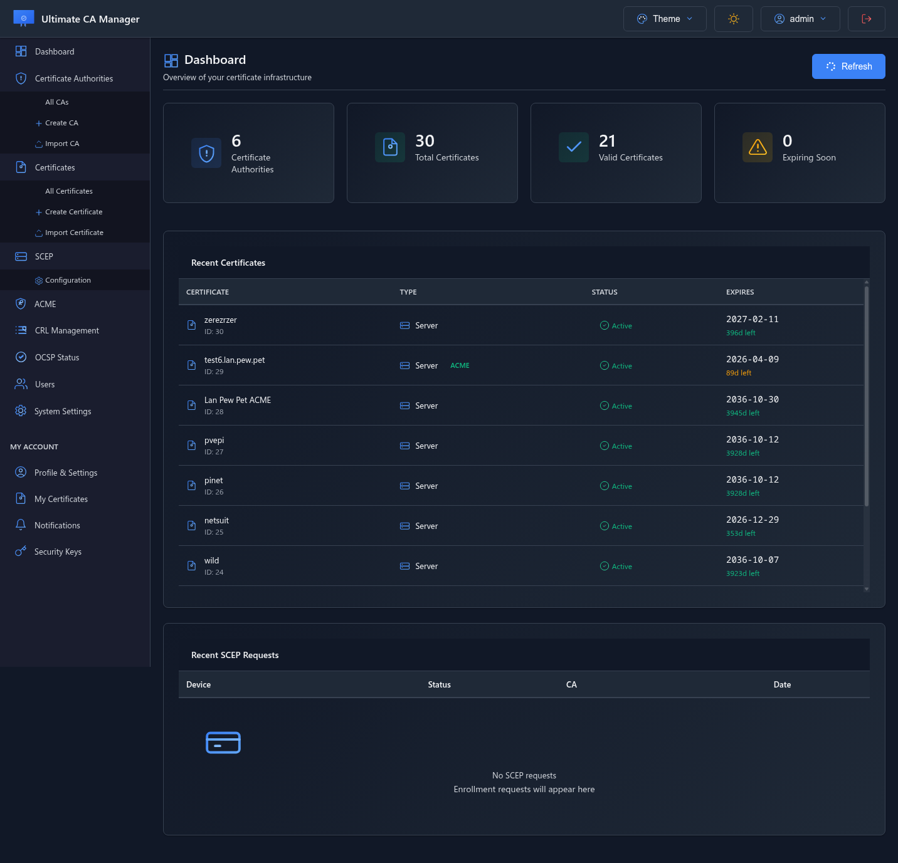
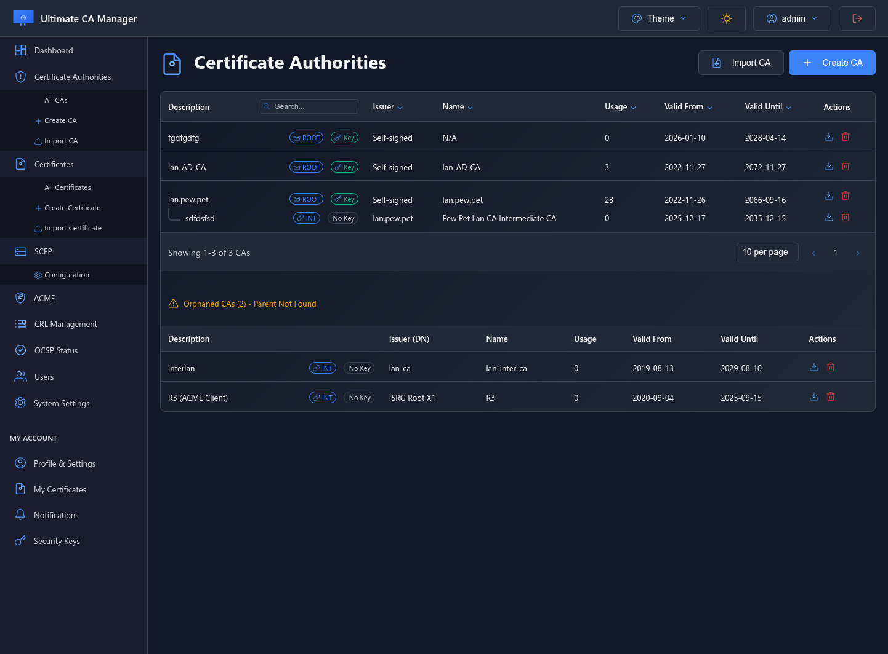
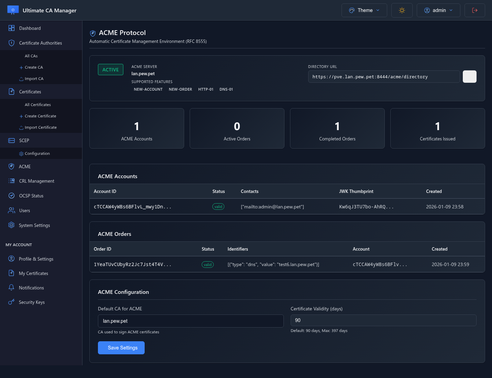
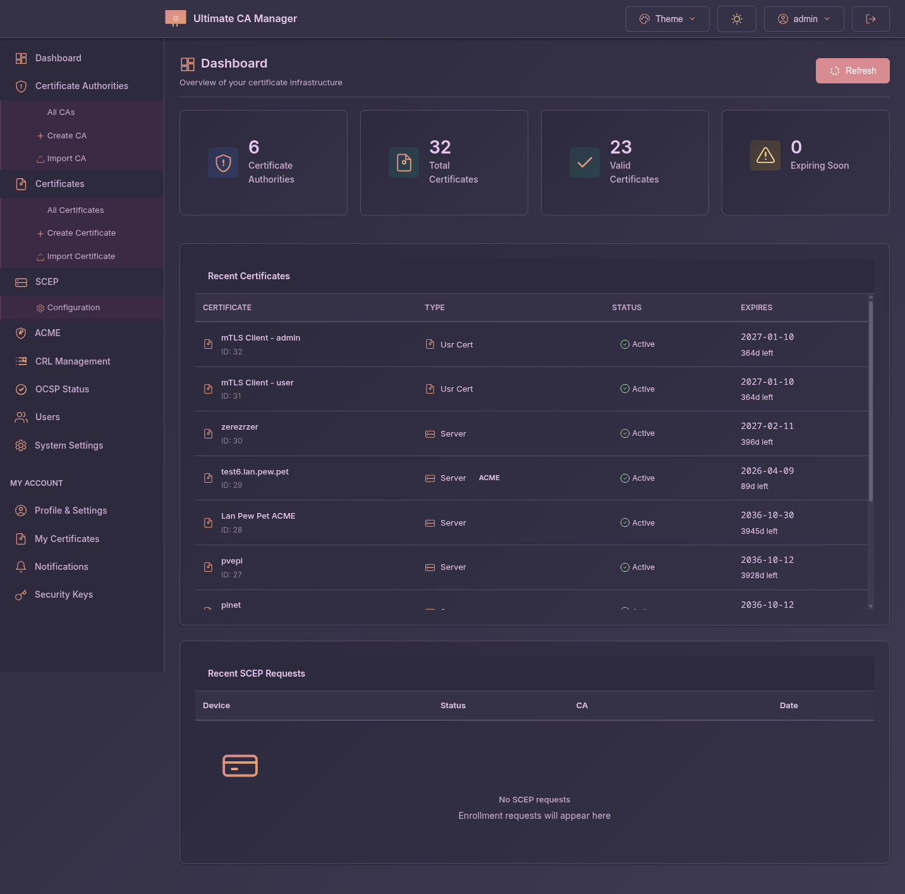

# Ultimate CA Manager


**Ultimate CA Manager (UCM)** is a comprehensive Certificate Authority management platform with full PKI protocol support (SCEP, OCSP, ACME, CRL/CDP), multi-factor authentication, and complete certificate lifecycle management.

---

## ✨ Key Features

### 🔐 Complete PKI Infrastructure
- **Full CA Management** - Create, import, manage Certificate Authorities with complete control
- **Certificate Lifecycle** - Generate, sign, revoke, renew, export certificates
- **CRL & CDP** - Certificate Revocation Lists with HTTP/HTTPS distribution points
- **OCSP Responder** - Real-time certificate status validation (RFC 6960)

### 📡 Industry Standard Protocols
- **SCEP Server** - RFC 8894 compliant auto-enrollment for network devices
- **ACME Support** - Let's Encrypt compatible (certbot, acme.sh)
- **OCSP** - Online Certificate Status Protocol
- **CRL/CDP** - Certificate Revocation List distribution

### 🔒 Advanced Security
- **mTLS Authentication** - Mutual TLS certificate-based authentication
- **WebAuthn/FIDO2** - Hardware security key support (YubiKey, etc.)
- **Multi-Factor Auth** - Multiple authentication methods
- **JWT Sessions** - Secure token-based authentication
- **HTTPS Only** - All traffic encrypted by default

### 🎨 Modern Interface
- **12 Theme Variants** - 6 color themes (Gray, Ocean, Purple, Forest, Sunset, Cyber) × Light/Dark modes
- **Auto Dark Mode** - "Follow System" automatically switches based on OS preference
- **React 18 + Radix UI** - Modern, accessible component library
- **Split-View Layout** - Sidebar, explorer panel, details panel
- **Responsive Design** - Mobile-first with adaptive layouts
- **Mobile Navigation** - Grid menu, theme/account quick access
- **Keyboard Shortcuts** - Cmd+K command palette for power users
- **Real-time Updates** - Instant feedback on all operations
- **[View Screenshots](docs/SCREENSHOTS.md)** - See all features in action

### 🚀 Deployment Options
- **Docker** - Multi-arch images (amd64, arm64) via GHCR
- **Debian/Ubuntu** - Native .deb packages
- **RHEL/Rocky/Alma** - Native .rpm packages
- **From Source** - Python 3.11+ with virtual environment

### ⚙️ Integration & Management
- **OPNsense Import** - Direct import from OPNsense firewalls
- **Email Notifications** - Certificate expiration alerts
- **Database Backup** - Manual backup creation via UI
- **REST API** - Full API for automation
- **Web Configuration** - All settings via web UI

---

## 📸 Screenshots

See all features in action: **[View Full Gallery](docs/SCREENSHOTS.md)**

<table>
<tr>
<td width="50%">

<b>Dashboard</b> - Overview and statistics
</td>
<td width="50%">

<b>CA Management</b> - Manage authorities
</td>
</tr>
<tr>
<td width="50%">

<b>ACME Server</b> - Let's Encrypt compatible
</td>
<td width="50%">

<b>12 Theme Variants</b> - 6 colors × Light/Dark
</td>
</tr>
</table>

---

## 🚀 Quick Start

### Universal Installer (All Linux Distributions)

**One-line install** - Auto-detects your OS and uses the best method:

```bash
curl -fsSL https://raw.githubusercontent.com/NeySlim/ultimate-ca-manager/main/packaging/scripts/install-ucm.sh | sudo bash
```

Or with wget:
```bash
wget -qO- https://raw.githubusercontent.com/NeySlim/ultimate-ca-manager/main/packaging/scripts/install-ucm.sh | sudo bash
```

✅ **Supports:** Debian, Ubuntu, RHEL, Rocky, Alma, Fedora, openSUSE, Arch, Alpine  
✅ **Smart:** Uses native packages (DEB/RPM) when available, otherwise installs from source  
✅ **Zero dependencies:** Only requires bash

### Docker (Recommended)

```bash
docker run -d \
  --name ucm \
  -p 8443:8443 \
  -v ucm-data:/app/backend/data \
  ghcr.io/neyslim/ultimate-ca-manager:1.8.3
```

**Access:** https://localhost:8443  
**Credentials:** admin / changeme123 ⚠️ **CHANGE IMMEDIATELY!**

### Docker Compose

```yaml
version: '3.8'
services:
  ucm:
    image: ghcr.io/neyslim/ultimate-ca-manager:1.8.3
    container_name: ucm
    ports:
      - "8443:8443"
    volumes:
      - ./data:/app/backend/data
    environment:
      - UCM_FQDN=ucm.example.com
      - UCM_ACME_ENABLED=true
      - UCM_SMTP_ENABLED=false
    restart: unless-stopped
```

### Debian/Ubuntu Package

```bash
# Download latest release
wget https://github.com/NeySlim/ultimate-ca-manager/releases/download/v1.8.3/ucm_1.8.3_all.deb

# Install (nginx optional!)
sudo dpkg -i ucm_1.8.3_all.deb
sudo systemctl enable --now ucm
```

### RHEL/Rocky/Alma Package

```bash
# Download latest release (⚠️ UNTESTED)
wget https://github.com/NeySlim/ultimate-ca-manager/releases/download/v1.8.3/ucm-1.8.3-1.el9.noarch.rpm

# Install
sudo dnf install ucm-1.8.3-1.el9.noarch.rpm
sudo systemctl enable --now ucm
```

---

## 📚 Documentation

### Installation & Setup
- [Installation Guide](docs/installation/README.md) - Complete installation instructions
- [Docker Guide](docs/installation/docker.md) - Docker deployment details
- [First Steps](docs/user-guide/first-steps.md) - Getting started guide

### User Guides
- [CA Management](docs/user-guide/ca-management.md) - Managing Certificate Authorities
- [Certificates](docs/user-guide/certificates.md) - Certificate operations
- [SCEP Server](docs/user-guide/protocols/scep.md) - SCEP configuration
- [ACME Support](docs/user-guide/protocols/acme.md) - ACME/Let's Encrypt
- [OCSP Responder](docs/user-guide/protocols/ocsp.md) - OCSP setup
- [CRL/CDP](docs/user-guide/protocols/crl.md) - Certificate revocation

### Administration
- [Configuration](docs/administration/configuration.md) - System configuration
- [User Management](docs/administration/user-management.md) - User accounts & roles
- [Backup & Restore](docs/administration/backup-restore.md) - Backup procedures
- [Monitoring](docs/administration/monitoring.md) - Health & monitoring

### Development
- [Architecture](docs/development/architecture.md) - System architecture
- [Building](docs/development/building.md) - Build from source
- [Contributing](docs/development/contributing.md) - Contribution guidelines
- [API Documentation](docs/development/api.md) - REST API reference

---

## 📡 API Endpoints

### Authentication
- `POST /api/auth/login` - User login
- `POST /api/auth/logout` - User logout
- `POST /api/auth/webauthn/*` - WebAuthn operations

### Certificate Authorities
- `GET /api/ca/list` - List all CAs
- `POST /api/ca/create` - Create new CA
- `DELETE /api/ca/{id}` - Delete CA
- `GET /api/ca/{id}/export` - Export CA

### Certificates
- `GET /api/certificates/list` - List certificates
- `POST /api/certificates/create` - Create certificate
- `POST /api/certificates/sign` - Sign CSR
- `POST /api/certificates/revoke` - Revoke certificate
- `GET /api/certificates/{id}/export` - Export certificate

### SCEP
- `GET /scep/pkiclient.exe` - SCEP enrollment endpoint
- `POST /scep/pkiclient.exe` - SCEP operations

### ACME
- `POST /acme/new-account` - Create ACME account
- `POST /acme/new-order` - Create certificate order
- `POST /acme/authz/{id}` - Authorization challenge
- `POST /acme/challenge/{id}` - Challenge validation
- `POST /acme/finalize/{id}` - Finalize order

### OCSP
- `POST /ocsp` - OCSP status request

### CRL
- `GET /crl/{ca_id}` - Download CRL for CA

---

## 🛠️ Technology Stack

- **Frontend:** React 18, Vite, Radix UI, Tailwind CSS
- **Backend:** Python 3.11, Flask, SQLAlchemy
- **Database:** SQLite
- **Server:** Gunicorn (production), Werkzeug (dev)
- **Cryptography:** pyOpenSSL, cryptography
- **Authentication:** Flask-Login, PyJWT, WebAuthn

---

## 🔧 Configuration

### Environment Variables (Docker)

```bash
# Network
UCM_FQDN=ucm.example.com         # Server FQDN
UCM_HTTPS_PORT=8443              # HTTPS port

# Database
UCM_DATABASE_PATH=/app/backend/data/ucm.db

# Security
UCM_SECRET_KEY=auto-generated    # Session secret key
UCM_MTLS_ENABLED=false          # Mutual TLS auth

# Features
UCM_ACME_ENABLED=true           # ACME protocol
UCM_CACHE_ENABLED=true          # Response caching

# Email (Optional)
UCM_SMTP_ENABLED=false
UCM_SMTP_SERVER=smtp.gmail.com
UCM_SMTP_PORT=587
UCM_SMTP_USER=your@email.com
UCM_SMTP_PASSWORD=yourpassword
UCM_SMTP_FROM=noreply@ucm.local
```

### System Configuration (DEB/RPM)

Edit `/etc/ucm/config.json` or use the web interface at **Settings → System Configuration**.

---

## 📦 Package Locations

### Docker
- **Data:** `/app/backend/data`
- **Config:** `/app/.env` (auto-generated)
- **Logs:** stdout/stderr

### DEB/RPM
- **Data:** `/opt/ucm/backend/data`
- **Config:** `/etc/ucm/config.json`
- **Logs:** `/var/log/ucm/`
- **Service:** `systemctl status ucm`

---

## 🔄 Upgrade

### Docker

```bash
docker pull ghcr.io/neyslim/ultimate-ca-manager:1.8.3
docker stop ucm
docker rm ucm
# Recreate container with same volume
```

### DEB/RPM

```bash
# Download new package
sudo dpkg -i ucm_1.8.3_all.deb  # Debian/Ubuntu
sudo dnf upgrade ucm-1.8.3-1.el9.noarch.rpm  # RHEL/Rocky/Alma
sudo systemctl restart ucm
```

---

## 🐛 Troubleshooting

### Container won't start
```bash
docker logs ucm
# Check certificate generation
docker exec ucm ls -l /app/backend/data/https*.pem
```

### Health check failing
```bash
# Test health endpoint
curl -k https://localhost:8443/api/health
```

### SSL/TLS errors
- Chrome/Edge: Type `thisisunsafe` on error page (temporary)
- Replace auto-generated certificate with trusted one via web UI

### Database locked
```bash
# Stop service
sudo systemctl stop ucm  # or docker stop ucm
# Remove lock
sudo rm /opt/ucm/backend/data/ucm.db-journal  # DEB/RPM
# Restart
sudo systemctl start ucm
```

---

## 🤝 Contributing

We welcome contributions! Please see [CONTRIBUTING.md](docs/development/contributing.md) for guidelines.

1. Fork the repository
2. Create feature branch (`git checkout -b feature/amazing-feature`)
3. Commit changes (`git commit -m 'Add amazing feature'`)
4. Push to branch (`git push origin feature/amazing-feature`)
5. Open Pull Request

---

## 📜 License

BSD 3-Clause License - See [LICENSE](LICENSE) file for details.

---

## 🙏 Acknowledgments

- Flask & SQLAlchemy teams
- HTMX & Alpine.js projects
- OpenSSL & cryptography library
- All contributors and users

---

## 📞 Support

- **Issues:** [GitHub Issues](https://github.com/NeySlim/ultimate-ca-manager/issues)
- **Wiki:** [GitHub Wiki](https://github.com/NeySlim/ultimate-ca-manager/wiki)
- **Discussions:** [GitHub Discussions](https://github.com/NeySlim/ultimate-ca-manager/discussions)

---

**Made with ❤️ by the UCM Team**

---

## 📚 Documentation

Comprehensive technical documentation is available in the [`/docs`](/docs) directory:

- **[UCM API Specification](/docs/UCM-API-SPECIFICATION.md)** - Complete API v2 contract, endpoint analysis, implementation plan
- **[API Wiring Audit](/docs/API-WIRING-AUDIT.md)** - Frontend/backend integration audit and bug reports
- **[Documentation Overview](/docs/README.md)** - Architecture, conventions, and contribution guidelines

**Current Status:** ✅ Production Ready - v2.0.0 with React frontend

