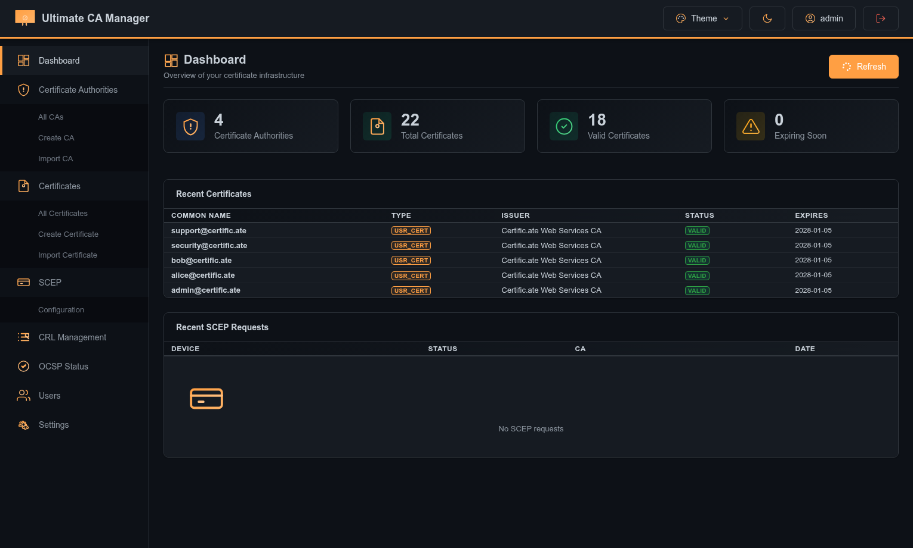
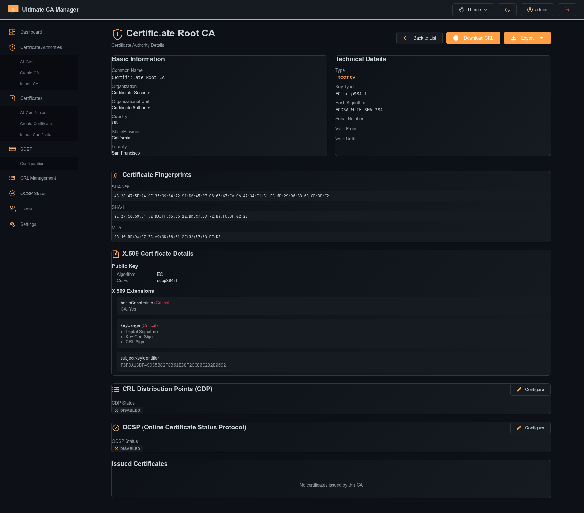
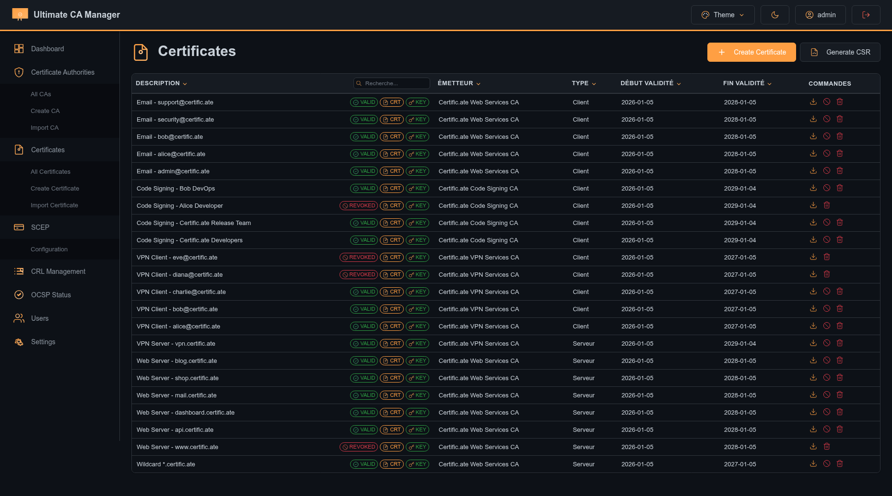
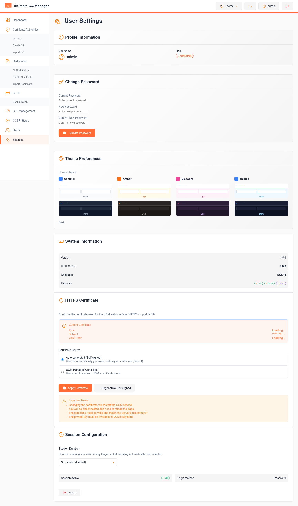
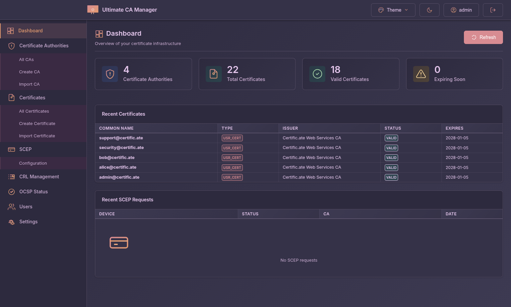
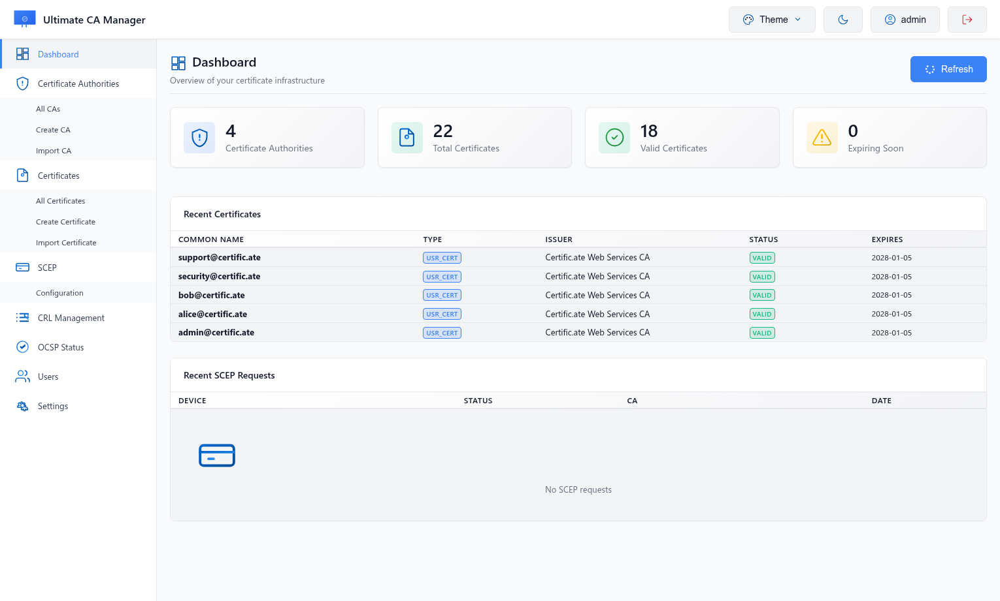

# Ultimate CA Manager


[](https://github.com/NeySlim/ultimate-ca-manager/actions/workflows/release-complete.yml)

**Ultimate CA Manager (UCM)** - Complete Certificate Authority management system with modern theming and RFC-compliant protocols.

## 📸 Screenshots

### Dashboard - Amber Dark Theme


### Certificate Authority Management


### Certificate List


### Multiple Themes
<table>
  <tr>
    <td><br/><i>Sentinel Light</i></td>
    <td><br/><i>Nebula Dark</i></td>
  </tr>
  <tr>
    <td><br/><i>Blossom Light</i></td>
    <td><br/><i>Amber Dark</i></td>
  </tr>
</table>

## ✨ Features

### Core CA Management
- 🔐 **HTTPS Only** - Auto-generated self-signed certificates
- 🔑 **Full CA Management** - Create, import, manage Certificate Authorities
- 📜 **Certificate Operations** - Generate, sign, revoke, export (PEM, DER, PKCS#12)
- 🔄 **CRL Distribution** - RFC 5280 compliant CRL Distribution Points
- 🟢 **OCSP Responder** - Real-time certificate status validation
- 🔗 **SCEP Server** - RFC 8894 compliant auto-enrollment

### User Experience
- 🎨 **8 Beautiful Themes** - Sentinel, Amber, Blossom, Nebula (Light & Dark)
- 🖱️ **Custom Scrollbars** - Theme-aware styled scrollbars
- 🌓 **Full Dark Mode** - Complete dark theme support
- 📱 **Responsive UI** - Works on desktop and mobile
- ⚡ **HTMX Powered** - Fast, modern SPA experience
- 🔒 **Modal Body Lock** - Smooth modal interactions

### Integration & Import
- 🔗 **OPNsense Import** - Direct import from OPNsense
- 📥 **CA Import** - Import existing CAs (PEM, PKCS#12)
- 📤 **Flexible Export** - Multiple export formats
- 🔌 **REST API** - Full API access

### Security & Compliance
- 👥 **User Management** - Role-based access control
- 🔐 **JWT Authentication** - Secure session management
- 📋 **RFC Compliant** - Follows PKI standards
- 🔒 **Public Endpoints** - CDP/OCSP accessible without auth

## 🚀 Quick Start

### Debian/Ubuntu Installation

```bash
# Download package
wget https://github.com/NeySlim/ultimate-ca-manager/releases/download/v1.6.0/ucm_1.6.0_all.deb

# Install
sudo dpkg -i ucm_1.6.0_all.deb

# Service will start automatically
```

### Manual Installation

```bash
# Clone repository
git clone https://github.com/NeySlim/ultimate-ca-manager.git
cd ultimate-ca-manager

# Run installation script
sudo ./install.sh

# Start service
sudo systemctl start ucm
```

**Web Interface:** https://your-server-ip:8443  
**Default Credentials:** admin / admin ⚠️ **CHANGE IMMEDIATELY!**

## 📡 API Endpoints

### Authentication
- `POST /api/v1/auth/login` - User login
- `POST /api/v1/auth/logout` - User logout
- `GET /api/v1/auth/me` - Get current user

### Certificate Authorities
- `GET /api/v1/ca/` - List all CAs
- `POST /api/v1/ca/` - Create new CA
- `GET /api/v1/ca/{id}` - Get CA details
- `POST /api/v1/ca/{id}/revoke` - Revoke CA
- `GET /api/v1/ca/{id}/export` - Export CA

### Certificates
- `GET /api/v1/certificates/` - List all certificates
- `POST /api/v1/certificates/` - Create certificate
- `GET /api/v1/certificates/{id}` - Get certificate details
- `POST /api/v1/certificates/{id}/revoke` - Revoke certificate
- `GET /api/v1/certificates/{id}/export` - Export certificate

### CRL & OCSP (Public Endpoints)
- `GET /cdp/{ca_refid}/crl.pem` - Download CRL (PEM)
- `GET /cdp/{ca_refid}/crl.der` - Download CRL (DER)
- `GET /cdp/{ca_refid}/info` - CRL information
- `POST /ocsp` - OCSP status request

### SCEP (Public Endpoints)
- `GET /scep/pkiclient.exe` - SCEP enrollment
- `POST /scep/pkiclient.exe` - SCEP operations

## 🎨 Themes

UCM includes 8 professionally designed themes:

**Light Themes:**
- **Sentinel Light** - Clean and professional
- **Amber Light** - Warm and inviting
- **Blossom Light** - Soft and elegant
- **Nebula Light** - Modern and vibrant

**Dark Themes:**
- **Sentinel Dark** - Professional dark mode
- **Amber Dark** - Warm dark palette
- **Blossom Dark** - Elegant dark theme
- **Nebula Dark** - Vibrant dark mode

All themes feature:
- Custom styled scrollbars
- Consistent color schemes
- Smooth transitions
- Optimized contrast ratios

## 📦 What's New in 1.6.0

### Major Changes
- ✨ **Complete Tailwind Removal** - Migrated to custom CSS with CSS variables
- 🎨 **Custom Scrollbars** - Theme-aware scrollbars for all 8 themes
- 🔒 **Modal Improvements** - Body scroll lock, proper z-indexing
- 📄 **CRL Info Pages** - Public and integrated CRL information views
- 🐛 **Bug Fixes** - Fixed HTMX triggers, JavaScript conflicts, theme flash

### Technical Details
- Removed ~827 Tailwind CSS classes
- Added modal-utils.js for consistent modal behavior
- Implemented HX-Trigger-After-Swap for modal opening
- Fixed variable conflicts (pkcs12ExportId, IconSystem, SessionManager)
- Enhanced theme consistency across all pages

See [CHANGELOG.md](CHANGELOG.md) for complete details.

## 🛠️ Development

### Requirements
- Python 3.11+
- Flask 3.0+
- SQLite 3
- OpenSSL

### Setup Development Environment

```bash
# Clone repository
git clone https://github.com/NeySlim/ultimate-ca-manager.git
cd ultimate-ca-manager

# Create virtual environment
python3 -m venv venv
source venv/bin/activate

# Install dependencies
pip install -r backend/requirements.txt

# Initialize database
python backend/init_db.py

# Run development server
python backend/app.py
```

### Build Debian Package

```bash
# Build package
./build_deb.sh

# Package will be created as ucm_1.6.0_all.deb
```

## 📚 Documentation

- [Installation Guide](INSTALLATION.md)
- [API Documentation](docs/API.md)
- [SCEP Setup Guide](docs/SCEP.md)
- [Changelog](CHANGELOG.md)

## 🤝 Contributing

Contributions are welcome! Please feel free to submit a Pull Request.

## 📄 License

BSD 3-Clause License - See [LICENSE](LICENSE) file for details

## 🙏 Acknowledgments

- Flask framework
- HTMX for modern interactions
- Alpine.js for reactive components
- Font Awesome for icons
- All contributors and testers

---

**Made with ❤️ by the UCM Team**
