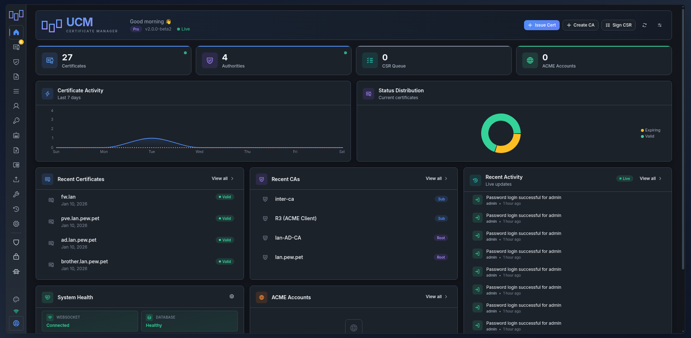
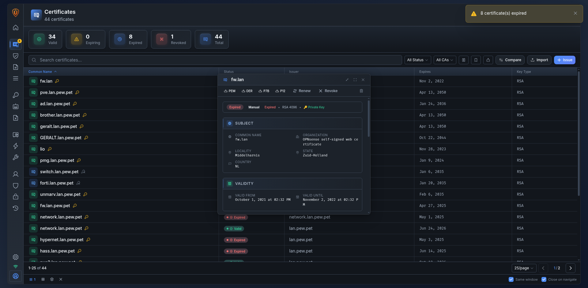
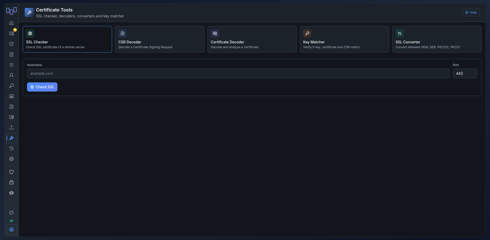
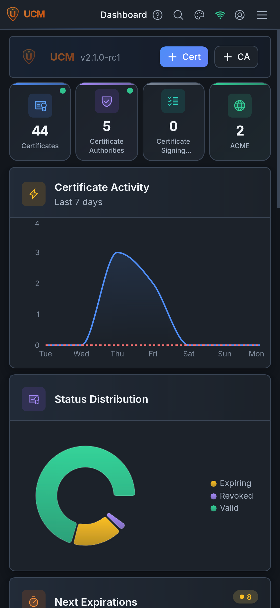
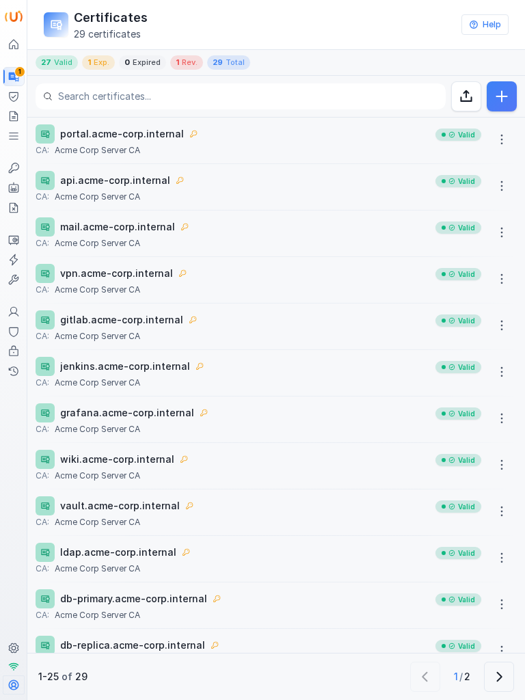
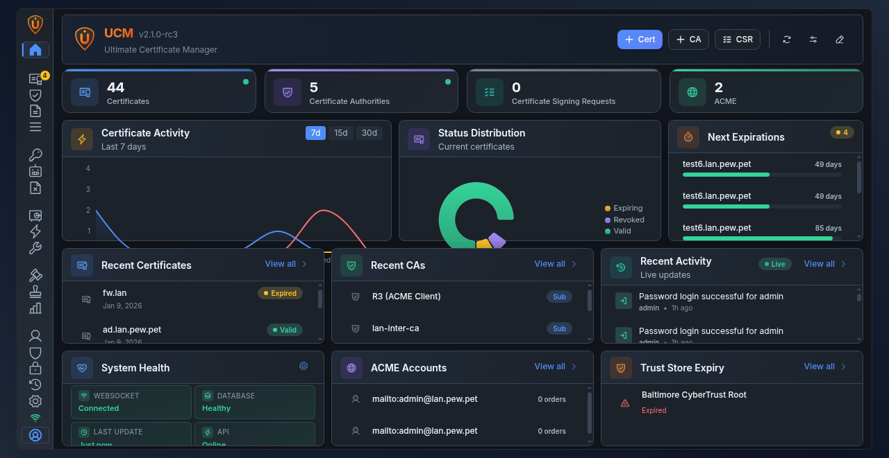
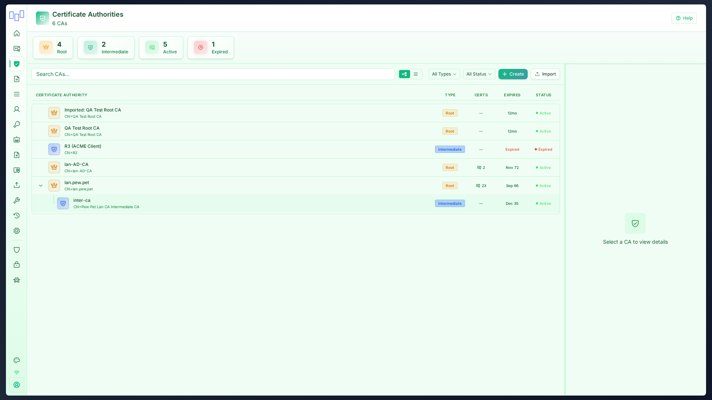
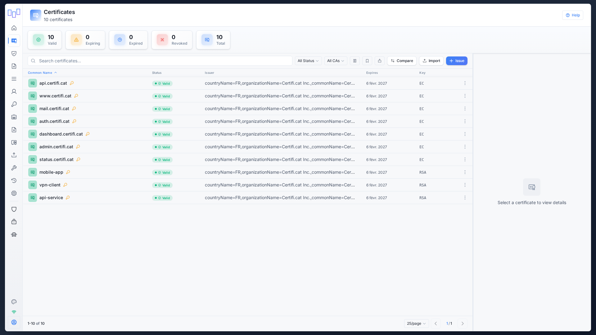
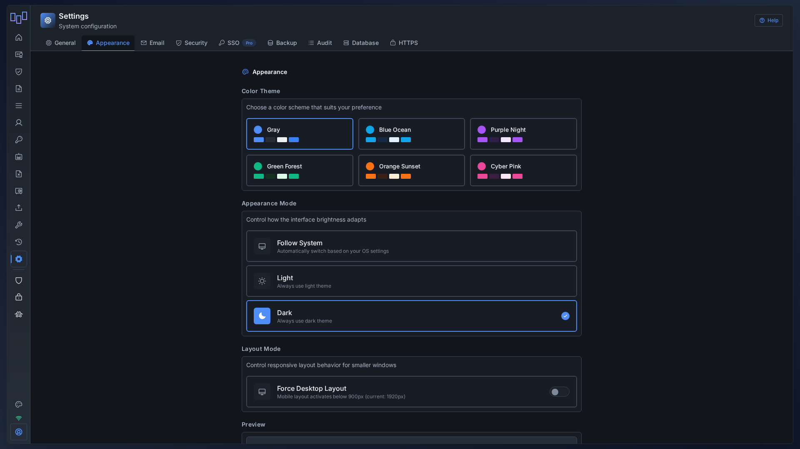

# Ultimate CA Manager


**Ultimate CA Manager (UCM)** is a comprehensive Certificate Authority management platform with full PKI protocol support (SCEP, OCSP, ACME, CRL/CDP), multi-factor authentication, and complete certificate lifecycle management.



---

## Key Features

### Complete PKI Infrastructure
- **Full CA Management** - Create, import, manage Certificate Authorities with hierarchy support
- **Certificate Lifecycle** - Generate, sign, revoke, renew, export certificates
- **CSR Management** - Create, import, sign Certificate Signing Requests
- **Certificate Templates** - Predefined configurations for server, client, code signing certificates
- **Chain Repair** - Automatic background task to repair and deduplicate certificate chains
- **CRL & CDP** - Certificate Revocation Lists with HTTP/HTTPS distribution points
- **OCSP Responder** - Real-time certificate status validation (RFC 6960)
- **Trust Store** - Manage trusted root CA certificates
- **AKI/SKI Chain Matching** - Cryptographic certificate chain validation using Authority/Subject Key Identifiers

### Certificate Toolbox
- **SSL Checker** - Verify SSL certificates on any hostname (TLS version, cipher suite, expiry)
- **CSR Decoder** - Parse and display CSR contents
- **Certificate Decoder** - Analyze certificate details (extensions, SANs, key usage)
- **Key Matcher** - Verify certificate and private key match
- **SSL Converter** - Convert between PEM, DER, PKCS#12, PKCS#7 formats

### Industry Standard Protocols
- **SCEP Server** - RFC 8894 compliant auto-enrollment for network devices
- **ACME Support** - Let's Encrypt compatible (certbot, acme.sh) with account management
- **OCSP** - Online Certificate Status Protocol responder
- **CRL/CDP** - Certificate Revocation List distribution points

### Advanced Security
- **HSM Integration** - SoftHSM included, hardware HSM via PKCS#11, Azure Key Vault, Google Cloud KMS
- **WebAuthn/FIDO2** - Hardware security key support (YubiKey, Passkeys)
- **mTLS Authentication** - Mutual TLS certificate-based authentication
- **TOTP Two-Factor** - Time-based one-time passwords
- **Password Strength** - Visual strength indicator with policy enforcement
- **Session Management** - Timeout warning, force password change
- **Audit Logs** - Full action logging with hash chain integrity verification
- **Rate Limiting** - Brute force protection on login
- **Session Cookies** - Secure httpOnly cookie + CSRF token authentication

### User & Group Management
- **User Groups** - Organize users with role-based access
- **API Keys** - Generate keys for automation and integrations
- **Session History** - Track all login sessions

### Modern Interface
- **12 Theme Variants** - 6 color themes (Gray, Ocean, Purple, Forest, Sunset, Cyber) × Light/Dark modes
- **Auto Dark Mode** - "Follow System" automatically switches based on OS preference
- **React 18 + Radix UI** - Modern, accessible component library
- **Split-View Layout** - Sidebar, explorer panel, details panel
- **Responsive Design** - Mobile-first with adaptive layouts
- **Command Palette** - Ctrl+K global search with quick actions
- **Real-time Updates** - WebSocket-based live refresh
- **Contextual Help** - Help modals on every page

### More Screenshots

| Certificates with Detail Panel | Certificate Toolbox |
|-------------------------------|---------------------|
|  |  |

| Mobile | Tablet |
|--------|--------|
|  |  |

### Deployment Options
- **Docker** - Multi-arch images (amd64, arm64) via Docker Hub & GHCR
- **Debian/Ubuntu** - Native .deb packages
- **RHEL/Rocky/Fedora** - Native .rpm packages
- **From Source** - Python 3.11+ with virtual environment

### Integration & Management
- **Smart Import** - Intelligent parser for certificates, keys, CSRs (drag & drop)
- **OPNsense Import** - Direct import from OPNsense firewalls
- **Bulk Export** - Export all certificates/CAs in one click
- **Email Notifications** - Certificate expiration alerts
- **Backup & Restore** - Full database backup with encryption
- **REST API v2** - Complete API for automation
- **Auto-Updates** - Check and install updates from UI

---

## Screenshots

See all features in action: **[View Full Gallery](docs/SCREENSHOTS.md)**

<table>
<tr>
<td width="50%">

<b>Dashboard</b> - Overview and statistics
</td>
<td width="50%">

<b>CA Management</b> - Manage authorities
</td>
</tr>
<tr>
<td width="50%">

<b>Certificates</b> - Full lifecycle management
</td>
<td width="50%">

<b>12 Theme Variants</b> - 6 colors × Light/Dark
</td>
</tr>
</table>

---

## Quick Start

### Universal Installer (All Linux Distributions)

**One-line install** - Auto-detects your OS and uses the best method:

```bash
curl -fsSL https://raw.githubusercontent.com/NeySlim/ultimate-ca-manager/main/packaging/scripts/install-ucm.sh | sudo bash
```

Or with wget:
```bash
wget -qO- https://raw.githubusercontent.com/NeySlim/ultimate-ca-manager/main/packaging/scripts/install-ucm.sh | sudo bash
```

✅ **Supports:** Debian, Ubuntu, RHEL, Rocky, Alma, Fedora, openSUSE, Arch, Alpine
✅ **Smart:** Uses native packages (DEB/RPM) when available, otherwise installs from source
✅ **Zero dependencies:** Only requires bash

### Debian/Ubuntu Package

```bash
# Download from https://github.com/NeySlim/ultimate-ca-manager/releases/latest
wget https://github.com/NeySlim/ultimate-ca-manager/releases/latest/download/ucm_all.deb

# Install
sudo apt install -y python3-venv python3-pip # Required dependencies
sudo dpkg -i ucm_*.deb
sudo systemctl enable --now ucm
```

### RHEL/Rocky/Fedora Package

```bash
# Download from https://github.com/NeySlim/ultimate-ca-manager/releases/latest
wget https://github.com/NeySlim/ultimate-ca-manager/releases/latest/download/ucm.noarch.rpm

# Install
sudo dnf install ./ucm-*.rpm
sudo systemctl enable --now ucm
```

### Docker

```bash
# From Docker Hub
docker run -d --restart=unless-stopped \
  --name ucm \
  -p 8443:8443 \
  -v ucm-data:/opt/ucm/data \
  neyslim/ultimate-ca-manager:latest

# Or from GitHub Container Registry
docker run -d --restart=unless-stopped \
  --name ucm \
  -p 8443:8443 \
  -v ucm-data:/opt/ucm/data \
  neyslim/ultimate-ca-manager:latest
```

**Access:** https://localhost:8443
**Credentials:** admin / (shown during install or in `/etc/ucm/ucm.env`) ⚠️ **CHANGE IMMEDIATELY!**

### Docker Compose

```yaml
services:
  ucm:
    image: neyslim/ultimate-ca-manager:latest
    container_name: ucm
    ports:
      - "8443:8443"
    volumes:
      - ./data:/opt/ucm/data
    environment:
      - UCM_FQDN=ucm.example.com
      - UCM_ACME_ENABLED=true
    restart: unless-stopped
```

---

## Documentation

Full documentation is available on the **[Wiki](https://github.com/NeySlim/ultimate-ca-manager/wiki)**.

### Quick Links
- [Installation Guide](https://github.com/NeySlim/ultimate-ca-manager/wiki/Installation-Guide)
- [Quick Start](https://github.com/NeySlim/ultimate-ca-manager/wiki/Quick-Start)
- [CA Management](https://github.com/NeySlim/ultimate-ca-manager/wiki/CA-Management)
- [Certificate Operations](https://github.com/NeySlim/ultimate-ca-manager/wiki/Certificate-Operations)
- [SCEP Server](https://github.com/NeySlim/ultimate-ca-manager/wiki/SCEP-Server)
- [ACME Support](https://github.com/NeySlim/ultimate-ca-manager/wiki/ACME-Support)
- [API Documentation](https://github.com/NeySlim/ultimate-ca-manager/wiki/API-Documentation)
- [Troubleshooting](https://github.com/NeySlim/ultimate-ca-manager/wiki/Troubleshooting)

---

## API v2

UCM provides a RESTful JSON API under `/api/v2/`. Full documentation in [OpenAPI spec](docs/openapi.yaml).

### Key Endpoints
| Resource | Endpoints |
|----------|-----------|
| **Auth** | `POST /api/v2/auth/login`, `/logout`, `/verify` |
| **CAs** | `GET/POST /api/v2/cas`, `GET/PUT/DELETE /api/v2/cas/{id}` |
| **Certificates** | `GET/POST /api/v2/certificates`, `POST .../revoke`, `POST .../renew` |
| **CSRs** | `GET/POST /api/v2/csrs`, `POST /api/v2/csrs/{id}/sign` |
| **ACME** | `GET /api/v2/acme/accounts`, `/orders`, `/challenges` |
| **SCEP** | `GET /scep/pkiclient.exe` (RFC 8894) |
| **OCSP** | `POST /ocsp` (RFC 6960) |
| **CRL** | `GET /crl/{ca_id}` |

---

## Technology Stack

- **Frontend:** React 18, Vite, Radix UI
- **Backend:** Python 3.11+, Flask, SQLAlchemy
- **Database:** SQLite (PostgreSQL supported)
- **Server:** Gunicorn with gevent WebSocket
- **Cryptography:** pyOpenSSL, cryptography
- **Authentication:** Session cookies, WebAuthn/FIDO2, TOTP

---

## Configuration

### Environment Variables (Docker)

```bash
# Network
UCM_FQDN=ucm.example.com # Server FQDN
UCM_HTTPS_PORT=8443 # HTTPS port

# Database
UCM_DATABASE_PATH=/opt/ucm/data/ucm.db

# Security
UCM_SECRET_KEY=auto-generated # Session secret key
UCM_MTLS_ENABLED=false # Mutual TLS auth

# Features
UCM_ACME_ENABLED=true # ACME protocol
UCM_CACHE_ENABLED=true # Response caching

# Email (Optional)
UCM_SMTP_ENABLED=false
UCM_SMTP_SERVER=smtp.gmail.com
UCM_SMTP_PORT=587
UCM_SMTP_USER=your@email.com
UCM_SMTP_PASSWORD=yourpassword
UCM_SMTP_FROM=noreply@ucm.local
```

### System Configuration (DEB/RPM)

Edit `/etc/ucm/config.json` or use the web interface at **Settings → System Configuration**.

---

## Package Locations (v2.x+)

### DEB/RPM (Harmonized)
- **Application:** `/opt/ucm/` (backend, frontend, venv)
- **Data:** `/opt/ucm/data/` (database, certificates)
- **Config:** `/etc/ucm/ucm.env`
- **Logs:** `/var/log/ucm/`
- **Service:** `systemctl status ucm`

### Docker
- **Application:** `/opt/ucm/`
- **Data:** `/opt/ucm/data/`
- **Config:** Environment variables
- **Logs:** stdout/stderr

---

## Upgrade

### Upgrading from v1.8.x to v2.x

Data and configuration are **automatically migrated**. A backup is created in `/opt/ucm/data/backups/`.

```bash
# Debian/Ubuntu - download from https://github.com/NeySlim/ultimate-ca-manager/releases/latest
sudo apt install -y python3-venv python3-pip
sudo dpkg -i ucm_*.deb
sudo systemctl restart ucm

# RHEL/Rocky/Fedora - download from https://github.com/NeySlim/ultimate-ca-manager/releases/latest
sudo dnf install ./ucm-*.rpm
sudo systemctl restart ucm
```

### What Gets Migrated
- Database (with schema updates)
- Certificates and CA files
- Configuration file

---

## Troubleshooting

### Container won't start
```bash
docker logs ucm
# Check certificate generation
docker exec ucm ls -l /opt/ucm/data/https*.pem
```

### Health check failing
```bash
# Test health endpoint
curl -k https://localhost:8443/api/health
```

### SSL/TLS errors
- Chrome/Edge: Type `thisisunsafe` on error page (temporary)
- Replace auto-generated certificate with trusted one via web UI

### Database locked
```bash
# Stop service
sudo systemctl stop ucm # or docker stop ucm
# Remove lock
sudo rm /opt/ucm/backend/data/ucm.db-journal # DEB/RPM
# Restart
sudo systemctl start ucm
```

---

## Contributing

We welcome contributions! Please see [CONTRIBUTING.md](docs/development/contributing.md) for guidelines.

1. Fork the repository
2. Create feature branch (`git checkout -b feature/amazing-feature`)
3. Commit changes (`git commit -m 'Add amazing feature'`)
4. Push to branch (`git push origin feature/amazing-feature`)
5. Open Pull Request

---

## License

BSD 3-Clause License - See [LICENSE](LICENSE) file for details.

---

## Acknowledgments

- Flask & SQLAlchemy teams
- React & Radix UI
- OpenSSL & cryptography library
- All contributors and users

---

## Support

- **Issues:** [GitHub Issues](https://github.com/NeySlim/ultimate-ca-manager/issues)
- **Wiki:** [GitHub Wiki](https://github.com/NeySlim/ultimate-ca-manager/wiki)
- **Discussions:** [GitHub Discussions](https://github.com/NeySlim/ultimate-ca-manager/discussions)

---

**Made by the UCM Team**

---

## Additional Documentation

Comprehensive technical documentation is available in the [`/docs`](/docs) directory and the **[Wiki](https://github.com/NeySlim/ultimate-ca-manager/wiki)**.

## What's New in v2.x

### Complete UI Redesign
- **Modern React 18 UI** - Responsive, accessible, mobile-friendly
- **12 Theme Variants** - 6 color themes × Light/Dark modes
- **Split-View Layout** - Master-detail navigation
- **Command Palette** - Ctrl+K for quick navigation and search

### New Features
- **User Groups** - Organize users with permission-based groups
- **Certificate Templates** - Predefined certificate configurations
- **Certificate Tools** - SSL checker, CSR/cert decoder, format converter
- **Smart Import** - Intelligent parser for certs, keys, CSRs
- **Trust Store** - Manage trusted CA certificates
- **ACME Management** - Account tracking, order history
- **Audit Logs** - Full action logging with export and verification
- **Dashboard Charts** - Certificate trends, status distribution

### Improvements
- **Unified Installation** - Same paths for DEB/RPM/Docker (`/opt/ucm/`)
- **Auto-migration** - Seamless v1.8.x → v2.0 upgrade with backup
- **WebSocket Support** - Real-time updates
- **API v2** - RESTful JSON API
- **Performance** - Faster loading, optimized queries

