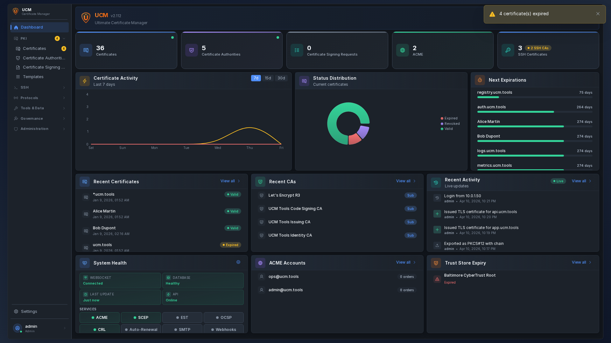

# Ultimate Certificate Manager


[](https://ko-fi.com/neyslim)

**Ultimate Certificate Manager (UCM)** is a web-based Certificate Authority management platform with PKI protocol support (ACME, SCEP, EST, OCSP, CRL/CDP), Microsoft ADCS integration, multi-factor authentication, and certificate lifecycle management.

> **UCM is a young and actively developed project.** Feedback, bug reports, and feature requests are very welcome! Feel free to [open an issue](https://github.com/NeySlim/ultimate-ca-manager/issues) — every report helps make UCM better.

> See the [latest release notes](https://github.com/NeySlim/ultimate-ca-manager/releases/latest) and the full [CHANGELOG](CHANGELOG.md) for what's new.



---

## Features

### PKI Core
- **CA Management** -- Root and intermediate CAs, hierarchy view, import/export, **HSM-backed signing keys** (private key never leaves the HSM), **configurable RFC 5280 profile** (signature digest, Key Usage, EKU) with Let's Encrypt-style defaults, **externally-signed CAs** (UCM generates the key pair and a CA-type CSR, an offline/external root signs it — the private key never leaves UCM, with same-key CSR renewal), **RFC 5280 name constraints** set at creation (permitted and excluded DNS, IP-range and e-mail subtrees, enforced on every issuance path)
- **Certificate Lifecycle** -- Issue, sign, revoke (with the RFC 5280 reason, from every revoke dialog and in bulk), renew (**in-place**: stable IDs across renewals, superseded serials stay on CRL/OCSP until their original expiry), rename (mutable display name, covers CN-less certificates), export (PEM, DER, PKCS#12 with a 3DES/SHA-1 compatibility mode for Android 15 and earlier, macOS 14 and earlier, older Windows and Java, JKS), bulk operations, filter by status / issuer / source (ACME, SCEP, EST, AD CS, import…)
- **Conformance Linting** -- per-certificate checks against RFC 5280 and CA/Browser Forum Baseline Requirements via pkilint (and zlint when available), informative-only
- **CSR Management** -- Create, import, sign Certificate Signing Requests with **custom Extra EKU OIDs** (RFC 5280 §4.2.1.12), **typed SAN validation** (DNS / IP / Email / URI / UPN), NIST P-256 / P-384 / P-521 curves
- **Certificate Templates** -- Predefined profiles for server, client, code signing, email, Windows smartcard logon; key types RSA-2048/3072/4096 and EC P-256/P-384/P-521 prefilled into the issue form
- **Certificate Discovery** -- Network scanning, scan profiles, scheduled scans, certificate import
- **Trust Store** -- Manage trusted root CA certificates with expiry alerts
- **Chain Repair** -- AKI/SKI-based chain validation with automatic repair scheduler
- **SSH Certificates** -- SSH Certificate Authority management, sign host/user certificates, import CAs and certs, curl-friendly setup scripts

### Protocols
- **ACME** -- RFC 8555, auto-enrollment, auto-renewal, DNS-01/HTTP-01/TLS-ALPN-01 challenges, wildcard support, **IP identifiers (RFC 8738)**, **CAA checking with account/method binding (RFC 8657/8659)**, **External Account Binding (EAB, RFC 8555 §7.3.4)**, **Renewal Information (ARI, RFC 9773)**, **custom DNS resolvers** for split-horizon, ACME on internal/private IPs (incl. opt-in loopback upstream for a colocated CA), **multi-CA management** (per-request CA selection, pinned on order so renewals reuse the same CA: Let's Encrypt, Actalis, ZeroSSL, Google Trust Services, HARICA…), **external CSR and renewal key reuse**, **staging preflight dry-run**, **multi-CA proxy** (pre-validated upstream domains pass straight through, per-CA endpoints at `/acme/proxy/<slug>/directory`, incl. upstream revocation), **preferred certificate chain** (RFC 8555 §7.4.2 alternates, per CA account), **certificate profiles** (draft-ietf-acme-profiles: named issuance policies advertised in the directory and selectable per order, each optionally bound to a certificate template whose key usage and EKU then govern the issued certificate, plus a configurable default signing digest for profile-less orders), **local server order management** (orders view with cleanup and a scheduled purge of expired orders); the proxy also publishes the client-side dns-01 TXT values so client propagation pre-checks (lego, Traefik, Caddy) pass as-is, and reuses an account's still-pending order on retries
- **SCEP** -- RFC 8894 device auto-enrollment with approval workflows, GetCert/GetCRL, signed GetNextCACert, AES-128 encryption with password-based (PBKDF2) fallback for non-RSA clients
- **EST** -- RFC 7030 Enrollment over Secure Transport, incl. server-side key generation (CMS §4.4) and **CA labels** (§3.2.2: serve several CAs from one endpoint)
- **OCSP** -- RFC 6960 real-time certificate status, multi-certificate requests, nonce support, delegated responder validation, configurable response validity
- **TSA (RFC 3161)** -- timestamp authority with configurable policy OID; signs with the CA certificate or a **dedicated end-entity signing certificate** picked from issued certificates or generated in one click (critical, exclusive timeStamping EKU for strict verifiers); timeStamping EKU required, renewals followed automatically, issuer chain embedded in tokens, strict dedicated-signer mode, signer health and expiry surfaced on the dashboard
- **CRL/CDP** -- Certificate Revocation List distribution with Delta CRL support (RFC 5280 §5.2.4), per-CA schedule (validity decoupled from publish cadence) and configurable signature digest, optional named URLs (CA-name slug in CDP/AIA paths, can be enabled on existing CAs), **externally-signed CRL upload for offline / key-less CAs** (validated against the CA certificate with CRL-number monotonicity, served at the existing CDP endpoint and consulted by OCSP)
- **AIA CA Issuers** -- Authority Information Access CA certificate download (RFC 5280 §4.2.2.1)

### Integrations
- **Microsoft ADCS** -- Full lifecycle over AD CS: CSR signing, template discovery, EOBO (Enroll On Behalf Of), renew/revoke through the connector, and an optional WinRM admin channel for CRL revocation sync, CA inventory import, and pending-request approve/deny with a CA health panel
- **HSM** -- SoftHSM included, PKCS#11, Azure Key Vault, Google Cloud KMS, OpenBao/Vault Transit; **HSM-backed CAs** with non-exportable signing keys
- **Kubernetes / cert-manager** -- Reference manifests for ClusterIssuer (HTTP-01 + DNS-01 with EAB), sample Certificate, Secret template under `examples/kubernetes/cert-manager/`
- **DNS Providers** -- Cloudflare, Route53, Azure DNS and more for ACME DNS-01 challenges
- **Webhooks** -- Event-driven notifications for certificate lifecycle events (15+ event types), **per-endpoint delivery history with manual retry**, durable async delivery queue with exponential backoff

### Security & Access
- **Authentication** -- Password, WebAuthn/FIDO2, TOTP 2FA, mTLS, API keys
- **SSO** -- LDAP, OAuth2 (Azure/Google/GitHub), SAML single sign-on with role mapping; **per-user `auth_source` tracking** and opt-in role sync on login
- **RBAC** -- 4 built-in roles (Admin, Operator, Auditor, Viewer) plus custom roles with granular permissions; **groups grant additional permissions** on top of a user's role (never administrator)
- **Policies & Approvals** -- Certificate issuance policies with approval workflows and enforced rules (allowed key types, DNS SAN cap, validity cap, scoped by CA, template or DNS pattern)
- **Audit Logs** -- Action logging with integrity verification and remote syslog forwarding
- **Private Key Encryption** -- AES-256 at rest under a master key file or `KEY_ENCRYPTION_KEY`; with encryption enabled no plaintext key file is kept on disk (existing mirrors are removed at enable time and at startup, public certificate files stay), and key files are recreated when it is disabled
- **Hardening** -- Operator-configurable HSTS (Settings → Security or env override), trusted-proxy gating of client-cert headers, API key permissions capped to the creator's own Trusted proxies can be given as CIDR networks and, once proxy support is on, `X-Forwarded-*` headers are honoured only from them, so a client reaching the backend directly cannot spoof its address

### Operations & Monitoring
- **Dashboard** -- Customizable drag-and-drop widgets, real-time stats, certificate trends
- **Reports** -- Scheduled PDF reports, executive summaries, custom templates
- **Certificate Toolbox** -- SSL checker, CSR/cert decoder, key matcher, format converter
- **Email Notifications** -- SMTP with **OAuth2 (XOAUTH2)** for Gmail, Outlook.com & Microsoft 365, customizable HTML/text templates, certificate expiry alerts with several day thresholds (one e-mail per threshold and validity period, escalating 30/14/7/1 style)
- **Deploy Hooks** -- Push issued and renewed certificates to remote hosts over SSH/SFTP: key-based auth (generated ed25519 or imported key, encrypted at rest), host-key pinning on first connect, per-binding destination paths (cert / key / full chain, written atomically), one fixed reload command per target, durable delivery queue with retries and per-delivery history and a **same-host preset** for services running next to UCM
- **Backup & Restore** -- Manual and scheduled encrypted backups with retention policies
- **Diagnostic Log Bundle** -- One-click download (Settings → About → Diagnostic) of application logs, error log, systemd journal and a secret-free system diagnostic as a ZIP, with sensitive tokens redacted
- **Prometheus Metrics** -- opt-in, bearer-gated `/metrics` endpoint exposing certificate, CA, scheduler, webhook and ACME counters
- **Scheduler** -- admin view of background tasks (expiry checks, CRL refresh, webhook delivery, backups, auto-renewal) with status and run-now
- **Self-serving HTTPS** -- apply any issued certificate to the web UI; the binding follows renewals automatically (files re-materialized, service restarted)
- **Safe networking defaults** -- dual-stack listening (`HOST=::` serves IPv6 and IPv4 on one socket), and admin Base URL guardrails (reachability check before applying, canonical redirect steps aside when the host stops resolving, `UCM_DISABLE_CANONICAL_REDIRECT=1` recovery switch)
- **Software Updates** -- In-app update checker with one-click install, scheduled daily check on a stable or release-candidate channel, and opt-in unattended install (DEB/RPM) with mandatory SHA256 verification and truthful outcome events (installed only after the actual install is version-verified), plus an optional one-time per-user release-notes window after an update
- **Global Search** -- Cross-resource search and command palette (Ctrl+K)

### Platform
- **6 Themes** -- 3 color schemes (Gray, Purple Night, Orange Sunset) × Light/Dark; **per-user preferences persisted server-side** (language, theme, mode)
- **i18n** -- 9 languages (EN, FR, DE, ES, IT, PT, UK, ZH, JA)
- **Persisted UI state** -- Filter selections persist across reloads on every list page
- **Database** -- SQLite (default) or **native PostgreSQL backend** with bidirectional migration UI
- **Responsive UI** -- React 18 + Radix UI, mobile-friendly
- **Real-time** -- WebSocket live updates
- **Multi-platform** -- Docker, Debian/Ubuntu (.deb), RHEL/Rocky/Fedora (.rpm)
- **Reverse proxy ready** -- Public ports independent of the listen ports (an explicit `:80` or `:443` in the base URLs is advertised as typed), trusted proxies by IP or CIDR network, and Helm chart `proxy.*` values for an Ingress in front of UCM

---

## Quick Start

### Docker

```bash
docker run -d --restart=unless-stopped \
  --name ucm \
  -p 8443:8443 \
  -p 8080:8080 \
  -v ucm-data:/opt/ucm/data \
  neyslim/ultimate-ca-manager:latest
```

Also available from GitHub Container Registry: `ghcr.io/neyslim/ultimate-ca-manager`

### Debian/Ubuntu

Download the `.deb` package from the [latest release](https://github.com/NeySlim/ultimate-ca-manager/releases/latest):

```bash
sudo dpkg -i ucm_<version>_all.deb
sudo systemctl enable --now ucm
```

### RHEL/Rocky/Fedora

Download the `.rpm` package from the [latest release](https://github.com/NeySlim/ultimate-ca-manager/releases/latest):

```bash
sudo dnf install ./ucm-VERSION-1.noarch.rpm
sudo systemctl enable --now ucm
```

**Access:** `https://localhost:8443` or `https://your-server-fqdn:8443`
**Default credentials:** `admin` / `changeme123` — you will be prompted to change on first login.

See [Installation Guide](docs/installation/README.md) for all methods including Docker Compose and source install.

---

## Documentation

| Resource | Link |
|----------|------|
| Wiki (full docs) | [github.com/NeySlim/ultimate-ca-manager/wiki](https://github.com/NeySlim/ultimate-ca-manager/wiki) |
| Installation | [docs/installation/](docs/installation/README.md) |
| User Guide | [docs/USER_GUIDE.md](docs/USER_GUIDE.md) |
| Admin Guide | [docs/ADMIN_GUIDE.md](docs/ADMIN_GUIDE.md) |
| API Reference | [docs/API_REFERENCE.md](docs/API_REFERENCE.md) |
| OpenAPI Spec | [docs/openapi.yaml](docs/openapi.yaml) |
| Security | [docs/SECURITY.md](docs/SECURITY.md) |
| Upgrade Guide | [UPGRADE.md](UPGRADE.md) |
| Changelog | [CHANGELOG.md](CHANGELOG.md) |

---

## Technology Stack

| Component | Technology |
|-----------|------------|
| Frontend | React 18, Vite, Radix UI, Recharts |
| Backend | Python 3.11+, Flask, SQLAlchemy |
| Database | SQLite |
| Server | Gunicorn + gevent WebSocket |
| Crypto | pyOpenSSL, cryptography |
| Auth | Session cookies, WebAuthn/FIDO2, TOTP, mTLS |

---

## File Locations

| Item | Path |
|------|------|
| Application | `/opt/ucm/` |
| Data & DB | `/opt/ucm/data/` |
| Config (DEB/RPM) | `/etc/ucm/ucm.env` |
| Logs (DEB/RPM) | `/var/log/ucm/` |
| Service | `systemctl status ucm` |

Docker: data at `/opt/ucm/data/` (mount as volume), config via environment variables, logs to stdout.

---

## Roadmap

- [ ] **High Availability / Clustering** — Active-passive or active-active HA deployment
- [ ] **Post-Quantum Cryptography** — ML-DSA, ML-KEM, SLH-DSA key types (NIST FIPS 203/204/205)
- [ ] **CMP Protocol (RFC 4210)** — Certificate Management Protocol support
- [x] **Reverse proxy fit and smartcard logon templates**: trusted proxies accept CIDR networks and gate every `X-Forwarded-*` header, the advertised admin and protocol ports can differ from the listen ports, the Helm chart wires the proxy settings and follows the release it ships with, the template editor builds Windows smartcard logon templates with a built-in one, and a reused ACME authorization records the challenge that was actually performed *(v2.224)*
- [x] **ACME profile templates and key-algorithm-aware key usage** — an ACME certificate profile can bind a certificate template whose key usage and EKU govern the issued certificate, and every issuance path (issue form, approvals, ACME, EST, SCEP, WSTEP) now derives key usage from the key algorithm, so ECDSA and Ed25519 leaves no longer assert `keyEncipherment` *(v2.221)*
- [x] **Security hardening, multi-endpoint SCEP, and access-control refinements** — an audit-driven hardening pass tightens issuance (per-path key-strength floor, CSR EKU capping, gated sub-CA minting), ACME (SAN types and subject bound to validated identifiers, SSRF guard on IP orders and cloud-metadata targets), and authorization (mTLS, API-key scoping, TSA, CSRF, SSH, OCSP, and direct private-key export gated behind an admin-only scope so Key Recovery's approval trail can't be bypassed); named SCEP profiles serve multiple enrollment endpoints, each with its own CA, template, challenge and approval policy; delegated OCSP responder certificates renew automatically; EAB credentials can be restricted to specific domains; and user groups can grant permissions from the UI *(v2.204)*
- [x] **Compatibility restore & configurable strictness** — the 2.200 hardening no longer breaks existing deployments: TSA, SCEP, EST, CAA and name-constraints checks default to pre-2.200-compatible behaviour with renewals graced at par, and every strictness switch (CAA enforcement, SCEP signingTime/clock skew, CT SCT embedding/require, OCSP response validity, syslog framing, OIDC ID-token verification incl. issuer/JWKS) is now configurable from the UI; certificate templates now govern the issued KU/EKU, with a `custom` type, an OCSP Signing system template and `OCSPSigning` selectable in the editor *(v2.203)*
- [x] **ACME certificate profiles, EST CA labels and RFC 7807 API errors** — clients can pick a named issuance profile advertised in the ACME directory; EST serves multiple CAs under path labels; API errors are now standard `application/problem+json` problem details while keeping the legacy keys for existing integrations *(v2.201)*
- [x] **Protocol conformance sweep** — RFC-coverage audit and fixes across ACME client/server (state machine, subproblems, TLS-ALPN-01/IP identifiers, upstream revocation, ARI `replaces`), SCEP (GetCert/GetCRL, AES + PBKDF2 encryption), EST (server-side key generation §4.4), OCSP (multi-request, delegated responder validation), CAA (RFC 8657 account/method binding), TSA, CT pre-certificate flow with embedded SCTs, and OIDC id_token verification *(v2.200)*
- [x] **ACME preferred certificate chain** — per-CA-account `preferred_chain` selects an RFC 8555 `Link: rel="alternate"` chain at download time (subject or issuer CN match, e.g. `ISRG Root X1`), in both the ACME client and proxy *(v2.193)*
- [x] **Microsoft AD CS full lifecycle** — Renew/revoke AD CS-issued certificates through the connector, plus an optional WinRM admin channel: revocation propagated to the CA, one-way CRL revocation sync, CA inventory import with reconciliation, and a control panel to approve/deny pending requests with CA health; [guide](https://github.com/NeySlim/ultimate-ca-manager/wiki/Microsoft-CA-Integration) *(v2.192)*
- [x] **Key Archival & Recovery** — Dual-control recovery of archived private keys: request → admin approve (four-eyes) → PKCS#12 download, fully audited; [guide](https://github.com/NeySlim/ultimate-ca-manager/wiki/Key-Recovery) *(v2.171)*
- [x] **Custom external ACME CA for issuance** — a configured custom ACME directory URL plus EAB (Settings → ACME client) is now used by issuance and renewal instead of always hitting Let's Encrypt; account row carries the directory/EAB atomically *(v2.180)*
- [x] **Multi-CA management with per-request selection** — issue from several external ACME CAs (Let's Encrypt, Actalis, ZeroSSL, Google Trust Services, HARICA…); each request picks its CA, the order is pinned to that account so renewals stay on the same authority; CRUD UI for CA accounts with per-account EAB and default selection *(v2.181)*
- [x] **Multi-CA ACME proxy endpoints** — each external CA account can expose its own proxy path at `/acme/proxy/<slug>/directory` alongside the legacy default endpoint, with per-account upstream credentials *(v2.185)*
- [x] **ACME external CSR, renewal key reuse & staging preflight** — finalize with an externally generated CSR (key never enters UCM), keep the same private key across renewals (DANE/TLSA), and dry-run requests against Let's Encrypt staging before touching production rate limits *(v2.184)*
- [x] **Code Signing** — Issue and manage code-signing certificates for Authenticode, JAR and macOS via the `codeSigning` EKU plus platform key purposes (kernel-mode, lifetime, Apple Developer ID); [usage guide](https://github.com/NeySlim/ultimate-ca-manager/wiki/Code-Signing) *(v2.171)*
- [x] **Helm chart** — Package UCM itself as a Helm chart for in-cluster deployment under `charts/ucm/` (single-instance, persistent `master.key`, SQLite or external PostgreSQL) *(v2.171)*
- [x] **SAN database columns derived from final SAN list** — `san_email` / `san_dns` / `san_ip` / `san_uri` always match the X.509 extension, with backfill migration *(v2.140)*
- [x] **On-disk certificate & CA files** — `.crt` / `.key` materialized to disk on every creation path *(v2.140)*
- [x] **ACME External Account Binding (EAB, RFC 8555 §7.3.4)** — Issue/rotate/revoke `kid`+`hmac` pairs for cert-manager / certbot / acme.sh *(v2.139)*
- [x] **ACME custom DNS resolvers + private-IP validation** — Split-horizon DNS, RFC1918/`.lan`/`.local` HTTP-01 & TLS-ALPN-01 *(v2.139)*
- [x] **Kubernetes / cert-manager integration** — Reference manifests for ClusterIssuer (HTTP-01 + DNS-01 with EAB) *(v2.139)*
- [x] **SMTP OAuth2 (XOAUTH2)** — Gmail, Outlook.com, Microsoft 365 modern auth *(v2.134)*
- [x] **SSO `auth_source` tracking + role preservation** — Per-user origin, optional sync-on-login, UI never overwritten *(v2.133)*
- [x] **HSM-backed Certificate Authorities** — Signing key generated/stored in HSM, never exportable *(v2.130)*
- [x] **Native PostgreSQL backend** — Bidirectional migration UI with safety checks *(v2.127)*
- [x] **PostgreSQL feature parity** — Database stats, optimize, integrity check, certificate activity chart all work natively on PostgreSQL *(v2.135)*
- [x] **Custom Extra EKU OIDs** — Microsoft RDP, smartcard logon, document signing, IPsec, Kerberos PKINIT… (RFC 5280 §4.2.1.12) *(v2.128)*
- [x] **Persisted UI filters** — Filter selections survive reloads on every list page *(v2.128)*
- [x] **User preferences server-side** — Language/theme follow the user across browsers *(v2.128)*
- [x] **Windows SSH CA setup script (`.ps1`)** — One-command trust setup for Windows OpenSSH Server *(v2.128/v2.134)*
- [x] **SSH Certificates** — SSH CA management, host/user certificate signing, import, setup scripts *(v2.112)*
- [x] **Security Audit** — Comprehensive security hardening: session fixation, export passwords, LDAP injection, LIKE escaping *(v2.112)*
- [x] **Certificate Transparency (RFC 6962)** — CT log submission, SCT parsing, auto-submit on issuance *(v2.109)*
- [x] **OCSP Delegated Responder (RFC 5019)** — Per-CA delegated responder assignment with EKU validation *(v2.109)*
- [x] **Certificate Practice Statement (CPS)** — Per-CA CPS URI and Policy OID in CertificatePolicies extension *(v2.109)*
- [x] **Multiple CDP/OCSP/AIA URLs** — Multiple distribution points and access descriptions per CA *(v2.109)*
- [x] **RFC 3161 Timestamp Authority (TSA)** — Time stamping server with configurable policy, hash algorithms, and accuracy *(v2.109)*
- [x] **In-App Help Translations** — 208 help files across 8 languages for all 26 sections *(v2.109)*
- [x] **ACME Auto-Supersede** — Automatically revoke old certificates on ACME renewal *(v2.110)*
- [x] **Universal Format Detection** — DER/PEM detection by content across all file uploads *(v2.110)*
- [x] **PKCS7/PKCS12 Decode** — Certificate decoder supports P7B bundles and PKCS12 files *(v2.111)*
- [x] **Delta CRL** — Incremental CRL updates for large deployments *(v2.75)*

## Contributing

1. Fork the repository
2. Create feature branch (`git checkout -b feature/my-feature`)
3. Commit and push
4. Open Pull Request

---

## License

BSD 3-Clause License with Commons Clause -- see [LICENSE](LICENSE).

---

## Support

- [GitHub Issues](https://github.com/NeySlim/ultimate-ca-manager/issues)
- [GitHub Wiki](https://github.com/NeySlim/ultimate-ca-manager/wiki)

If you find UCM useful, consider supporting its development:

<a href="https://ko-fi.com/neyslim"></a>

