# UCM Screenshots Gallery

## Dashboard

*Main dashboard with certificate statistics and recent activity*

## Certificate Management

### Certificate Authorities List

*View and manage all Certificate Authorities*

### Certificates List
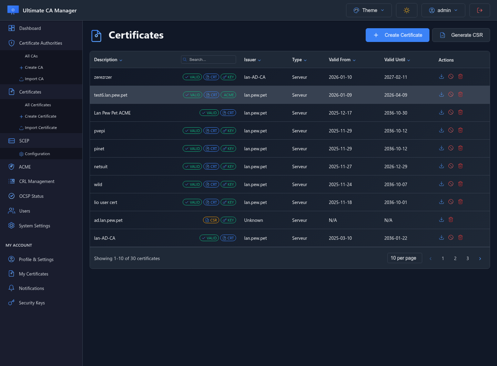
*Browse all issued certificates with filtering and search*

### Certificate Revocation Lists (CRL)
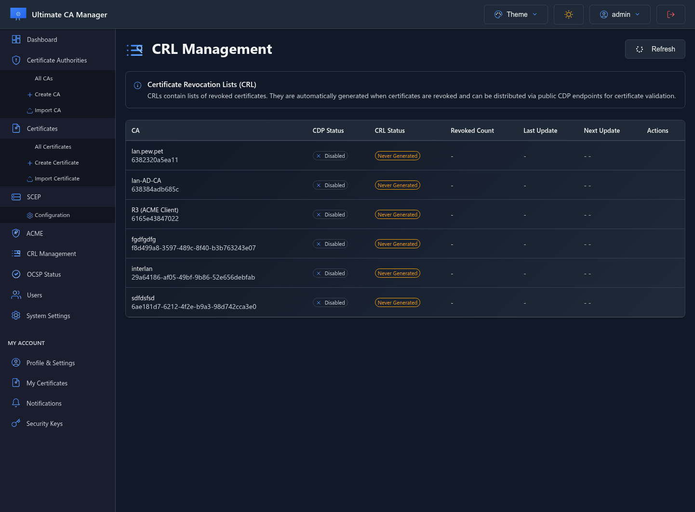
*CRL generation and distribution management*

## Protocol Support

### ACME Server

*ACME protocol configuration (Let's Encrypt compatible)*

### SCEP Service
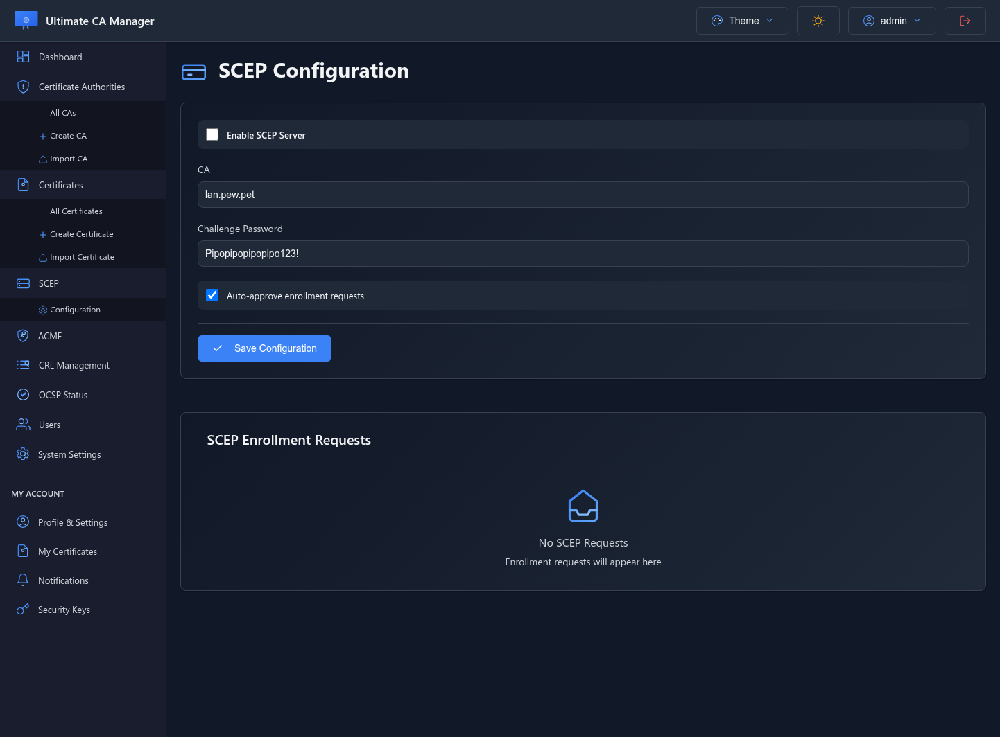
*SCEP enrollment for mobile devices and network equipment*

### OCSP Responder
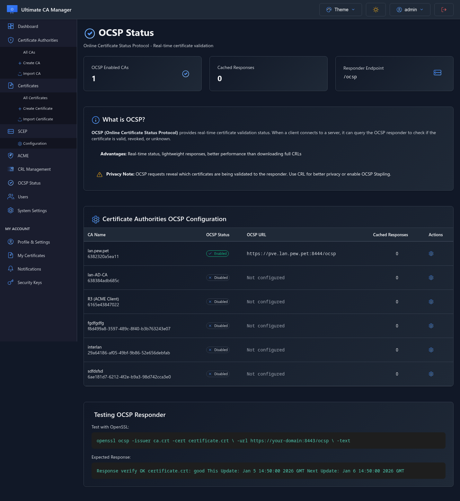
*Real-time certificate validation via OCSP*

## User Management

### User Accounts
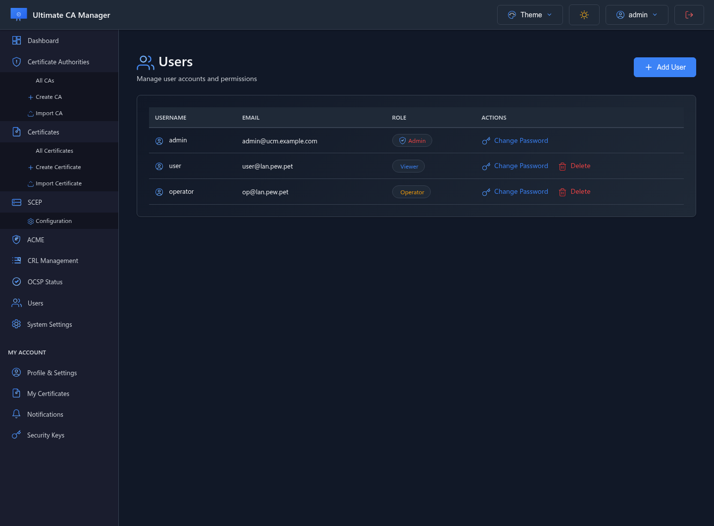
*User management with role-based access control*

### User Profile Settings
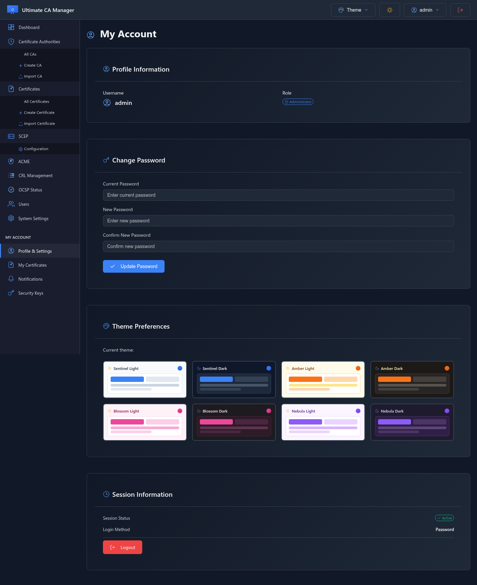
*Personal account settings and preferences*

### My Certificates (mTLS)
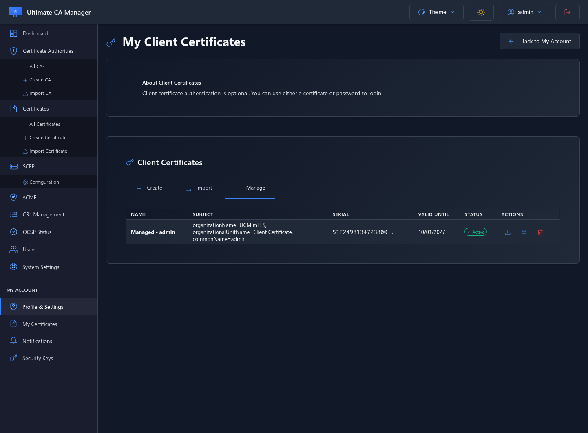
*User's personal client certificates for mTLS authentication*

### WebAuthn/FIDO2
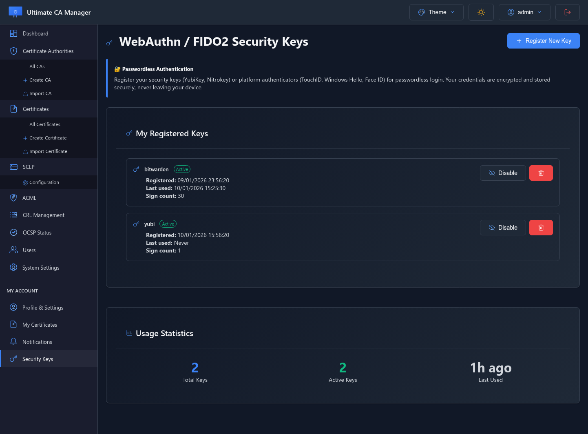
*Passwordless authentication with hardware security keys*

## Security Features

### mTLS Configuration
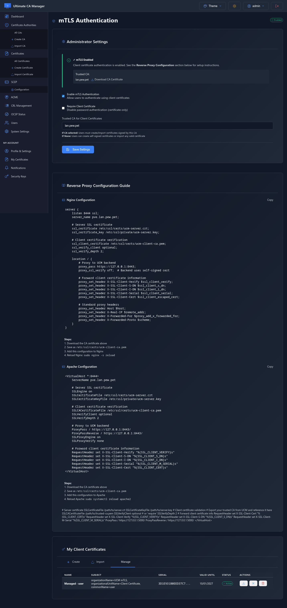
*Mutual TLS authentication settings*

### Email Notifications
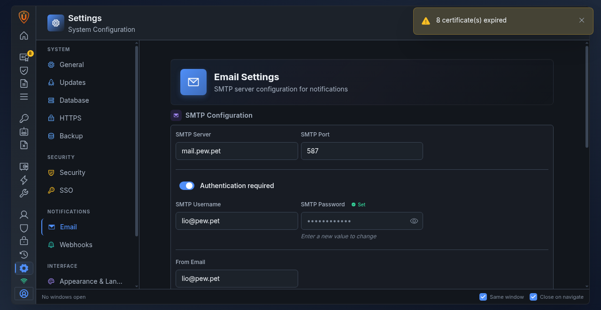
*Certificate expiration alerts and notifications*

## System Configuration

### System Settings
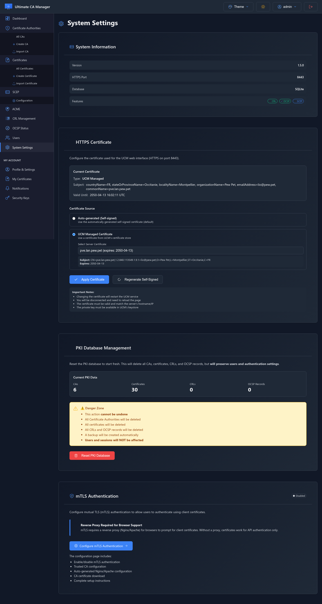
*Global system configuration and HTTPS certificate management*

## Themes

### Amber Light Theme
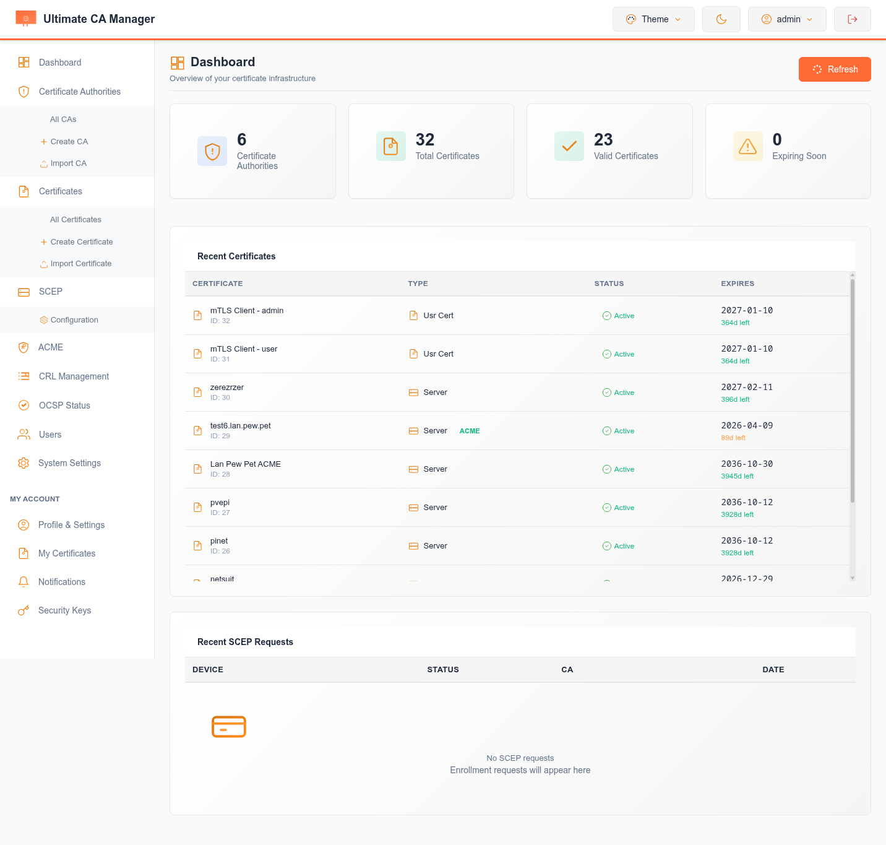
*Clean and professional light theme*

### Blossom Dark Theme

*Beautiful dark theme with pink accents*

---

**Available Themes:**
- Sentinel (Light/Dark) - Default professional theme
- Amber (Light/Dark) - Warm golden tones
- Nebula (Light/Dark) - Blue cosmic theme
- Blossom (Light/Dark) - Pink floral theme

All themes support both light and dark modes with smooth transitions.
