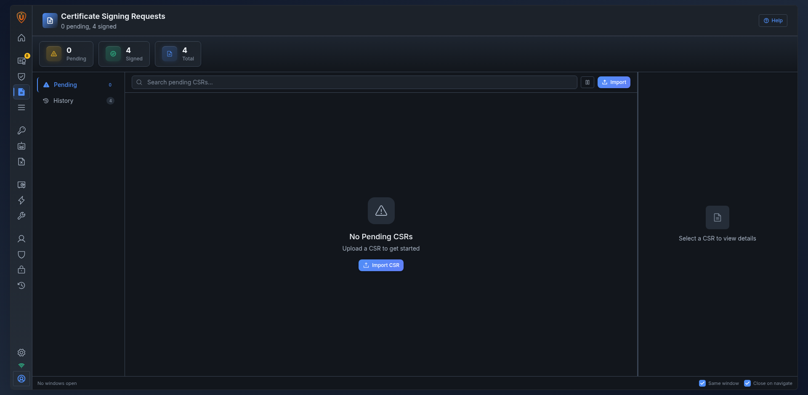
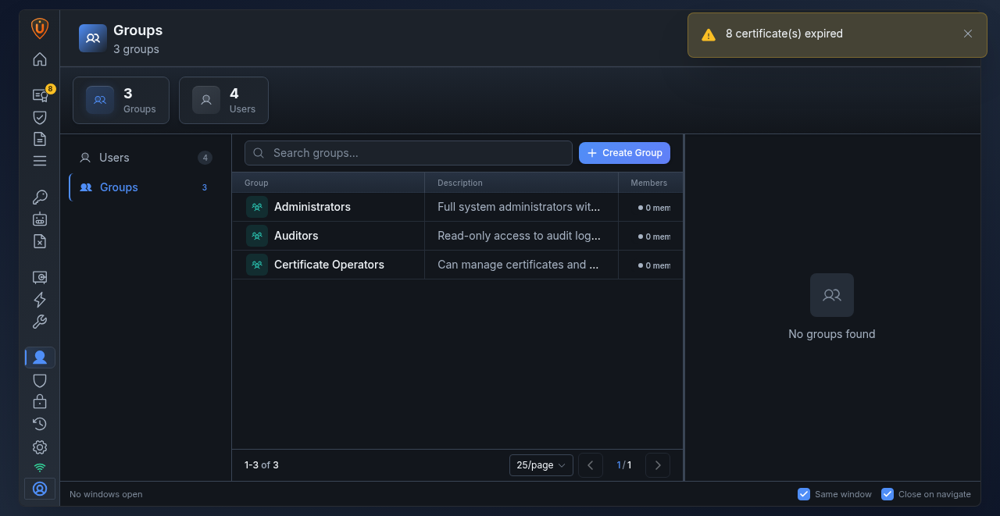
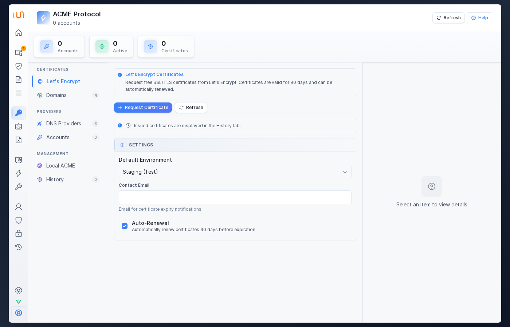
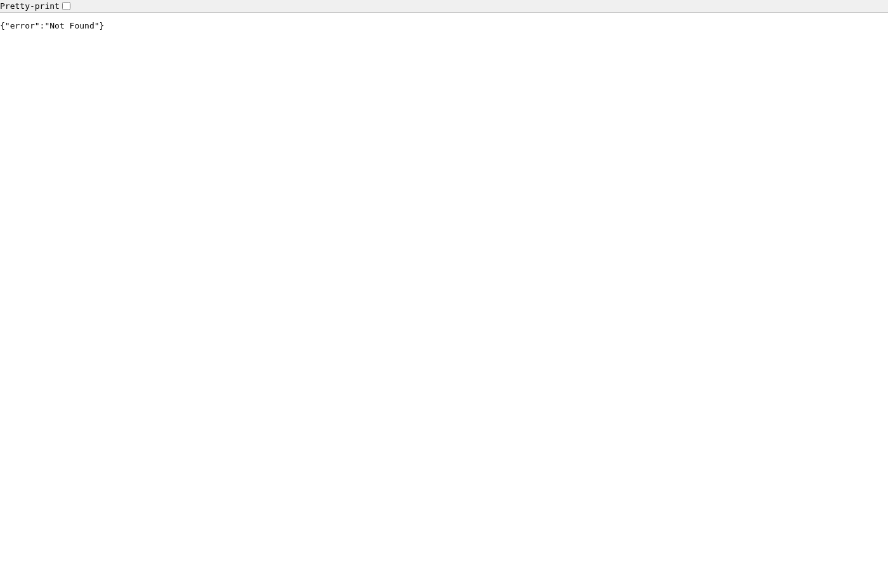
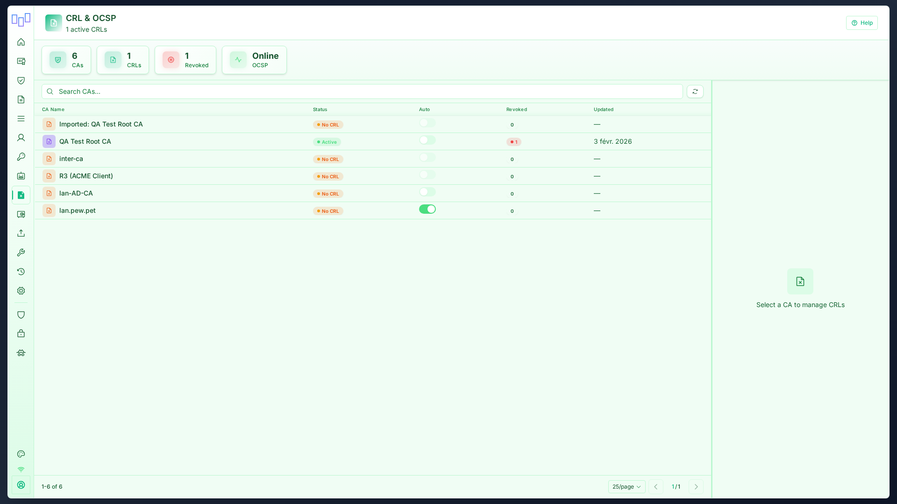
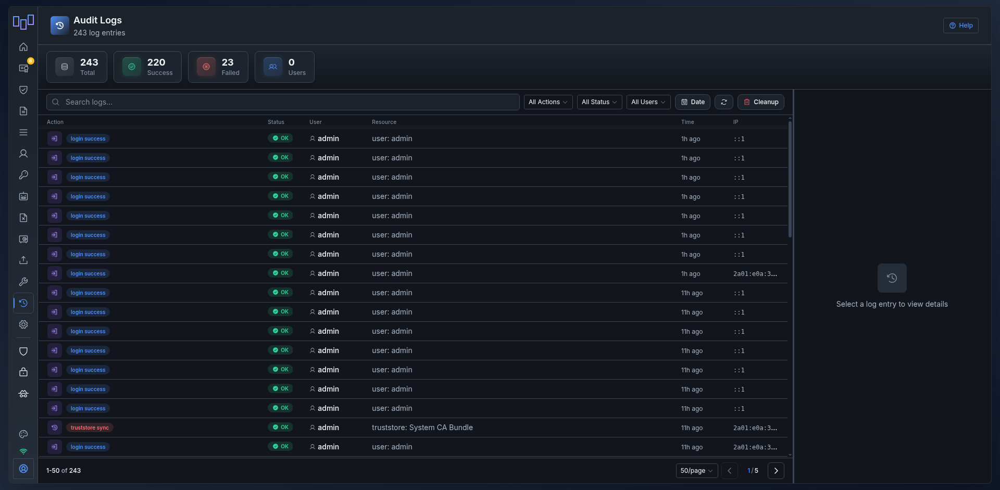
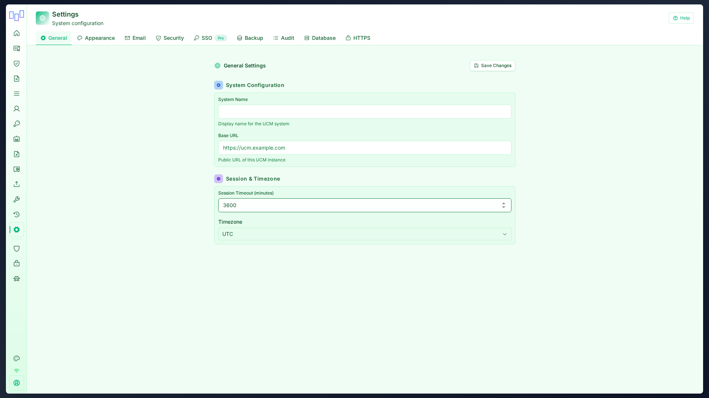

# UCM v2.0.0 Screenshots Gallery

## 🎨 New React UI

UCM v2.0.0 features a completely redesigned interface built with React 18 and Radix UI components.

## Dashboard

*Modern dashboard with real-time statistics, activity feed, and system health*

*Dashboard in dark mode*

## Certificate Management

### Certificate Authorities

*Manage Root and Intermediate Certificate Authorities*

### Certificates

*Browse, filter, and manage all certificates*

### Certificate Signing Requests

*Review and sign pending certificate requests*

### Groups

*Organize certificates into custom groups*

## Protocol Support

### ACME Server

*ACME protocol configuration - Let's Encrypt compatible (certbot, acme.sh)*

### SCEP Service

*SCEP enrollment for mobile devices and network equipment*

### CRL/OCSP

*Certificate Revocation Lists and OCSP Responder configuration*

## Administration

### Audit Logs

*Complete action logging with filtering and export*

### Settings

*System configuration with multiple tabs*

### Theme Selection

*6 color themes × Light/Dark modes = 12 theme variants*

---

## 🎨 Available Themes

| Theme | Light | Dark |
|-------|-------|------|
| Gray | ⚪ | ⚫ |
| Blue Ocean | 🔵 | 🌊 |
| Purple Night | 💜 | 🌌 |
| Green Forest | 💚 | 🌲 |
| Orange Sunset | 🧡 | 🌅 |
| Cyber Pink | 💗 | 🌸 |

All themes support:
- **Light/Dark modes** with smooth transitions
- **Follow System** option for automatic switching
- Persistent preference per user
