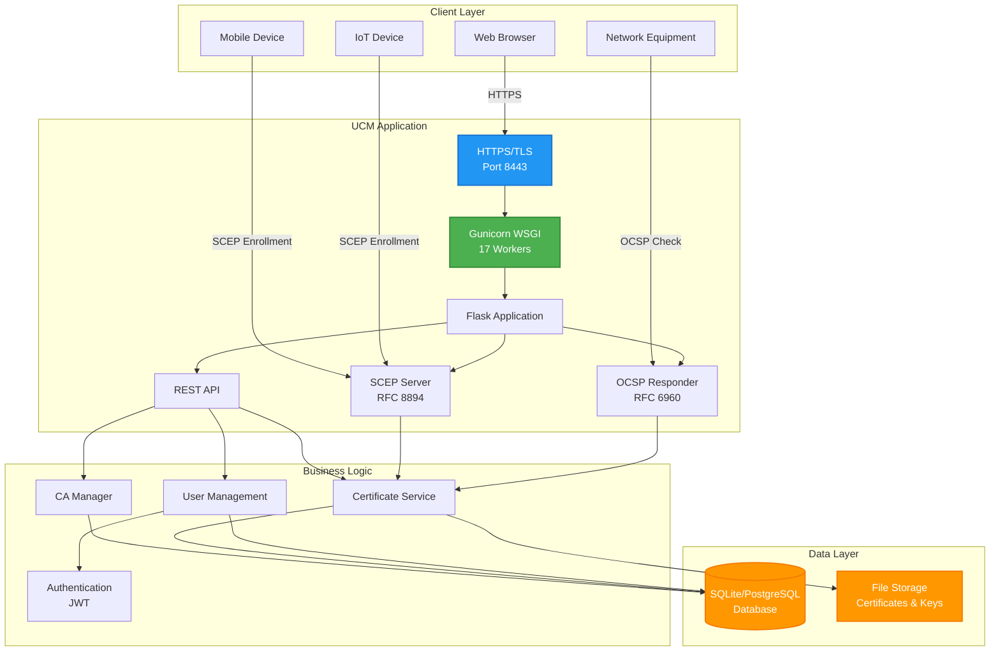
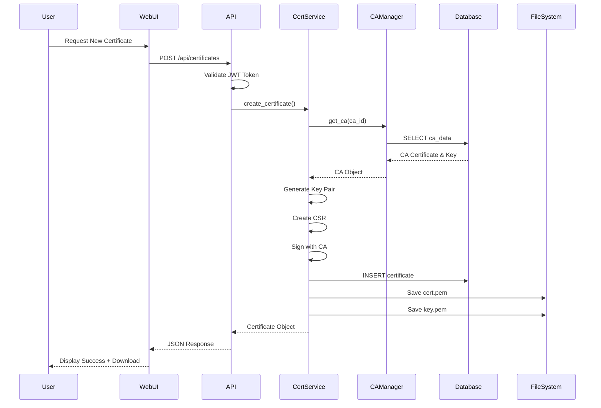
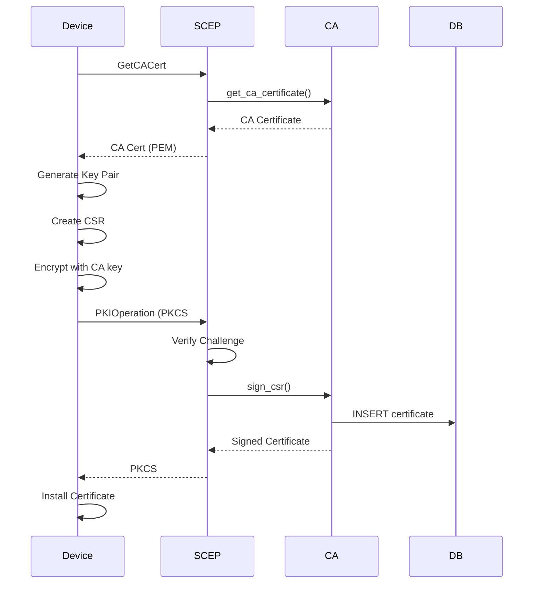
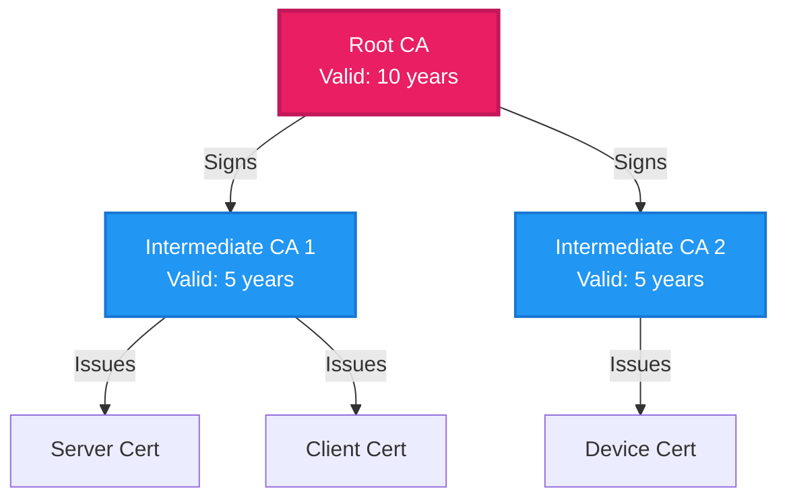
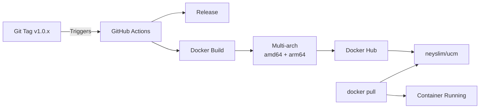

# UCM Architecture Diagrams

This document contains Mermaid diagrams that are automatically rendered on GitHub.

## System Architecture

## Certificate Issuance Flow

## SCEP Enrollment Flow

## CA Hierarchy

## Docker Deployment

---

**Note**: These diagrams render automatically on GitHub!
